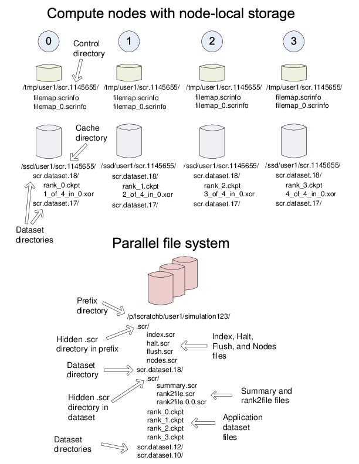
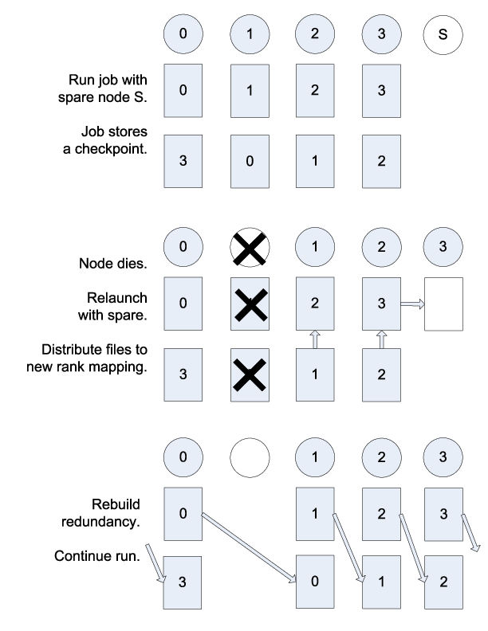

.. _concepts:

Overview
========

This section covers basic concepts and terms used throughout the SCR
documentation and source code.

.. _integration:

Intro to the SCR API
--------------------

This section provides an overview of how one may integrate the SCR API
into an application. For a more detailed discussion, please refer to the
user manual.

SCR is designed to support MPI applications that write application-level
checkpoints, primarily as a file-per-process. In a given checkpoint,
each process may actually write zero or more files, but the current
implementation assumes that each process writes roughly the same amount
of data. The checkpointing code for such applications may look like the
following:

::

   int main(int argc, char* argv[]) {
     MPI_Init(argc, argv);

     for (t = 0; t < TIMESTEPS; t++) {
       /* ... do work ... */

       /* every so often, write a checkpoint */
       if (t % CHECKPOINT_FREQUENCY == 0)
         checkpoint();
     }

     MPI_Finalize();
     return 0;
   }

   void checkpoint() {
     /* rank 0 creates a directory on the file system,
      * and then each process saves its state to a file */

     /* get rank of this process */
     int rank;
     MPI_Comm_rank(MPI_COMM_WORLD, &rank);

     /* rank 0 creates directory on parallel file system */
     if (rank == 0)
       mkdir(checkpoint_dir);

     /* hold all processes until directory is created */
     MPI_Barrier(MPI_COMM_WORLD);

     /* build file name of checkpoint file for this rank */
     char checkpoint_file[256];
     sprintf(checkpoint_file, "%s/rank_%d".ckpt",
       checkpoint_dir, rank
     );

     /* each rank opens, writes, and closes its file */
     FILE* fs = open(checkpoint_file, "w");
     if (fs != NULL) {
       fwrite(checkpoint_data, ..., fs);
       fclose(fs);
     }
   }

The following code exemplifies the changes necessary to integrate SCR.
Each change is numbered for further discussion below.

::

   int main(int argc, char* argv[]) {
     MPI_Init(argc, argv);

     /**** change #1 ****/
     SCR_Init();

     for (t = 0; t < TIMESTEPS; t++) {
       /* ... do work ... */

       /**** change #2 ****/
       int need_checkpoint;
       SCR_Need_checkpoint(&need_checkpoint);
       if (need_checkpoint)
         checkpoint();
     }

     /**** change #3 ****/
     SCR_Finalize();

     MPI_Finalize();
     return 0;
   }

   void checkpoint() {
     /* rank 0 creates a directory on the file system,
      * and then each process saves its state to a file */

     /**** change #4 ****/
     SCR_Start_checkpoint();

     /* get rank of this process */
     int rank;
     MPI_Comm_rank(MPI_COMM_WORLD, &rank);

     /**** change #5 ****/
     /*
         if (rank == 0)
           mkdir(checkpoint_dir);

         /* hold all processes until directory is created */
         MPI_Barrier(MPI_COMM_WORLD);
     */

     /* build file name of checkpoint file for this rank */
     char checkpoint_file[256];
     sprintf(checkpoint_file, "%s/rank_%d".ckpt",
       checkpoint_dir, rank
     );

     /**** change #6 ****/
     char scr_file[SCR_MAX_FILENAME];
     SCR_Route_file(checkpoint_file, scr_file);

     /**** change #7 ****/
     /* each rank opens, writes, and closes its file */
     FILE* fs = open(scr_file, "w");
     if (fs != NULL) {
       fwrite(checkpoint_data, ..., fs);
       fclose(fs);
     }

     /**** change #8 ****/
     SCR_Complete_checkpoint(valid);
   }

First, as shown in change #1, one must call ``SCR_Init()`` to initialize
the SCR library before it can be used. SCR uses MPI, so SCR must be
initialized after MPI has been initialized. Similarly, as shown in
change #3, it is good practice to shut down the SCR library by calling
``SCR_Finalize()``. This must be done before calling ``MPI_Finalize()``.
As shown in change #2, the application may rely on SCR to determine when
to checkpoint by calling ``SCR_Need_checkpoint()``. SCR can be
configured with information on failure rates and checkpoint costs for
the particular host platform, so this function provides a portable
method to guide an application toward an optimal checkpoint frequency.

Then, as shown in change #4, the application must inform SCR when it is
starting a new checkpoint by calling ``SCR_Start_checkpoint()``.
Similarly, it must inform SCR when it has completed the checkpoint with
a corresponding call to ``SCR_Complete_checkpoint()`` as shown in change
#8. When calling ``SCR_Complete_checkpoint()``, each process sets the
``valid`` flag to indicate whether it wrote all of its checkpoint files
successfully. SCR manages checkpoint directories, so the ``mkdir``
operation is removed in change #5.

Between the call to ``SCR_Start_checkpoint()`` and
``SCR_Complete_checkpoint()``, the application must register each of its
checkpoint files by calling ``SCR_Route_file()`` as shown in change #6.
SCR “routes” the file by replacing any leading directory on the file
name with a path that points to another directory in which SCR caches
data for the checkpoint. As shown in change #7, the application must use
the exact string returned by ``SCR_Route_file()`` to open its checkpoint
file.

All SCR functions are collective, except for ``SCR_Route_file()``.
Additionally, SCR imposes the following semantics:

#. A process of a given MPI rank may only access files previously
   written by itself or by processes having the same MPI rank in prior
   runs. We say that a rank “owns” the files it writes. A process is
   never guaranteed access to files written by other MPI ranks.

#. During a checkpoint, a process may only access files of the current
   checkpoint between calls to ``SCR_Start_checkpoint()`` and
   ``SCR_Complete_checkpoint()``. Once a process calls
   ``SCR_Complete_checkpoint()`` it is no longer guaranteed access to
   any file it registered during that checkpoint via a call to
   ``SCR_Route_file()``.

#. During a restart, a process may only access files from its “most
   recent” checkpoint, and it must access those files between calls to
   ``SCR_Init()`` and ``SCR_Start_checkpoint()``. That is, a process
   cannot access its restart files until it calls ``SCR_Init()``, and
   once it calls ``SCR_Start_checkpoint()``, it is no longer guaranteed
   access to its restart files. SCR selects which checkpoint is
   considered to be the “most recent”.

These semantics enable SCR to cache checkpoint files on devices that are
not globally visible to all processes, such as node-local storage.
Further, these semantics enable SCR to move, reformat, or delete
checkpoint files as needed, such that it can manage this cache, which
may be small.

Jobs, allocations, and runs
---------------------------

A large-scale simulation often must be restarted multiple times in order
to run to completion. It may be interrupted due to a failure, or it may
be interrupted due to time limits imposed by the resource scheduler. We
use the term *allocation* to refer to an assigned set of compute
resources that are available to the user for a period of time. A
resource manager typically assigns an id to each resource allocation,
which we refer to as the *allocation id*. SCR uses the allocation id in
some directory and file names. Within an allocation, a user may execute
a simulation one or more times. We call each execution a *run*. For MPI
applications, each run corresponds to a single invocation of ``mpirun``
or its equivalent. Finally, multiple allocations may be required to
complete a given simulation. We refer to this series of one or more
allocations as a *job*. To summarize, one or more runs occur within an
allocation, and one or more allocations occur within a job.

Group, store, and redundancy descriptors
----------------------------------------

SCR duplicates ``MPI_COMM_WORLD`` and stores a copy in
``scr_comm_world``. Each process also caches its rank and the size of
``scr_comm_world`` in ``scr_my_rank_world`` and ``scr_ranks_world``,
respectively. This communicator is created during ``SCR_Init()``, and it
is freed during ``SCR_Finalize()``. The variables are defined in
``scr_globals.h`` and declared and initialized in ``scr_globals.c``.

The SCR library must group processes of the parallel job in various
ways. For example, if power supply failures are common, it is necessary
to identify the set of processes that share a power supply. Similarly,
it is necessary to identify all processes that can access a given
storage device, such as an SSD mounted on a compute node. To represent
these groups, the SCR library uses a *group descriptor*. Details of
group descriptors are given in
Section :ref:`Group descriptors <group_descriptors>`.

The library creates two groups by default: ``NODE`` and ``WORLD``. The
``NODE`` group consists of all processes on the same compute node, and
``WORLD`` consists of all processes in the run. The user or system
administrator can create additional groups via configuration files.

The SCR library must also track details about each class of storage it
can access. For each available storage class, SCR needs to know the
associated directory prefix, the group of processes that share a device,
the capacity of the device, and other details like whether the
associated file system can support directories. SCR tracks this
information in a *store descriptor*. Each store descriptor refers to a
group descriptor, which specifies how processes are grouped with respect
to that class of storage. Group descriptors must exist before the store
descriptors can be created. For a given storage class, it is assumed
that all compute nodes refer to the class using the same directory
prefix. Each store descriptor is referenced by its directory prefix.
Details of store descriptors are given in
Section :ref:`Store descriptors <store_descriptors>`.

The library creates one store descriptor by default: ``/tmp``. The
assumption is made that ``/tmp`` is mounted as a local file system on
each compute node. On Linux clusters, ``/tmp`` is often RAM disk or a
local hard drive. Additional store descriptors can be defined by the
user or system administrator in configuration files.

Finally, SCR defines *redundancy descriptors* to associate a redundancy
scheme with a class of storage and a group of processes that are likely
to fail at the same time. It also tracks details about the particular
redundancy scheme used, and the frequency with which it should be
applied. Redundancy descriptors reference both store and group
descriptors, so these must exist before the SCR library creates its
internal redundancy descriptors. Details about redundancy descriptors
are given in Section :ref:`Redundancy descriptors <redundancy_descriptors>`.

The library creates a default redundancy descriptor. It assumes that
processes on the same node are likely to fail at the same time. It also
assumes that checkpoints can be cached in ``/tmp``, which is assumed to
be storage local to each compute node. It applies an ``XOR`` redundancy
scheme using a group size of 8. Additional redundancy descriptors may be
defined by the user or system administrator in configuration files.

All of these descriptors (group, store, and redundancy) are defined by
the system administrator or user in system or user configuration files.
Additionally, some predefined descriptors are created by the library.

.. _checkpoint_directories:

Control, cache, and prefix directories
--------------------------------------

SCR manages numerous files and directories to cache checkpoint data and
to record its internal state. There are three fundamental types of
directories: control, cache, and prefix directories. For a detailed
illustration of how these files and directories are arranged, see the
example presented in Section directories_example_.

The *control directory* is where SCR writes files to store its internal
state about the current run. This directory is expected to be stored in
node-local storage. SCR writes multiple, small files in the control
directory, and it may access these files frequently. It is best to
configure this directory to be stored in a node-local RAM disk.

To construct the full path of the control directory, SCR incorporates a
control base directory name along with the user name and allocation id
associated with the resource allocation, such that the control directory
is of the form: ``<controlbase>/<username>/scr.<allocationid>``. This
enables multiple users, or multiple jobs by the same user, to run at the
same time without conflicting for the same control directory. The
control base directory is hard-coded into the SCR library at configure
time, but this value may be overridden via a system configuration file.
The user may not change the control base directory.

SCR directs the application to write checkpoint files to subdirectories
within a *cache directory*. SCR also stores its redundancy data files in
these subdirectories. The device serving the cache directory must be
large enough to hold the data for one or more checkpoints plus the
associated redundancy data. Multiple cache directories may be utilized
in the same run, which enables SCR to use more than one class of storage
within a run (e.g., RAM disk and SSD). Cache directories should be
located on scalable storage.

To construct the full path of a cache directory, SCR incorporates a
cache base directory name with the user name and allocation id
associated with the resource allocation, such that the cache directory
is of the form: ``<cachebase>/<username>/scr.<allocationid>``. A set of
valid cache base directories is hard-coded into the SCR library at
configure time, but this set can be overridden in a system configuration
file. Out of this set, the user may select a subset of cache base
directories that should be used during a run. A cache directory may be
the same as the control directory.

The user must configure the maximum number of checkpoints that SCR
should keep in each cache directory. It is up to the user to ensure that
the capacity of the device associated with the cache directory is large
enough to hold the specified number of checkpoints.

For now, SCR only handles checkpoint output sets. However, there are
plans to eventually support general, non-checkpoint output sets. SCR
refers to each application output set as a *dataset*, where a checkpoint
is a dataset having a certain property, namely that it can be used to
restart the simulation. SCR assigns a unique sequence number to each
dataset called the *dataset id*. SCR also assigns a unique sequence
number to each checkpoint called the *checkpoint id*. It assigns dataset
ids starting from 1 and counts up with each successive dataset written
by the application. Similarly, it starts checkpoint ids from 1 and
increments the checkpoint id with each successive checkpoint. The
library manages these counters in the ``scr_dataset_id`` and
``scr_checkpoint_id`` global variables defined in ``scr.c``.

Within a cache directory, a dataset is written to its own subdirectory
called the *dataset directory*. SCR associates each dataset with a
*redundancy descriptor*. The redundancy descriptor describes which cache
directory should be used, which redundancy scheme to apply, and how
often it should be used
(Section :ref:`Redundancy descriptors <redundancy_descriptors>`).
A single run employs a set of one or more redundancy descriptors, and
each descriptor is assigned a unique integer index counting up from 0.
When starting a new checkpoint, SCR selects a redundancy descriptor, and
then it creates a corresponding dataset directory within the cache
directory. The full path of the dataset directory is of the form:
``<cachebase>/<username>/scr.<allocationid>/scr.dataset.<datasetid>``.

Finally, the *prefix directory* is a directory on the parallel file
system that the user specifies. SCR copies datasets to the prefix
directory for permanent storage
(Section :ref:`Fetch, Flush, and scavenge <fetch_flush_drain>`). The
prefix directory should be accessible from all compute nodes, and the
user must ensure that the prefix directory name is unique for each job.
For each dataset stored in the prefix directory, SCR creates and manages
a *dataset directory*. The dataset directory holds all files associated
with a particular dataset, including application files and SCR
redundancy files. SCR maintains an index file within the prefix
directory, which records information about each dataset stored there.

Note that the term “dataset directory” is overloaded. In some cases, we
use this term to refer to a directory in cache and in other cases we use
the term to refer to a directory within the prefix directory on the
parallel file system. In any particular case, the meaning should be
clear from the context.

.. _directories_example:

Example of SCR files and directories
------------------------------------

To illustrate how various files and directories are arranged in SCR,
consider the example shown in Figure :ref:`directories_wide`. In this
example, a user named “``user1``” runs a 4-task MPI job with one task
per compute node. The base directory for the control directory is
``/tmp``, the base directory for the cache directory is ``/ssd``, and
the prefix directory is ``/p/lscratchb/user1/simulation123``. The
control and cache directories are storage devices local to the compute
node.

.. _directories_wide:

   Example of SCR Directories

The full path of the control directory is ``/tmp/user1/scr.1145655``.
This is derived from the concatenation of the base directory (``/tmp``),
the user name (``user1``), and the allocation id (``1145655``). SCR
keeps files to persist its internal state in the control directory,
including filemap files (Section :ref:`Filemap files <filemap_file>`) and the
transfer file (Section :ref:`Transfer file <transfer_file>`).

Similarly, the cache directory is ``/ssd/user1/scr.1145655``, which is
derived from the concatenation of the cache base directory (``/ssd``),
the user name (``user1``), and the allocation id (``1145655``). Within
the cache directory, SCR creates a subdirectory for each dataset. The
dataset directory name includes the dataset id. In this example, there
are two datasets currently stored in cache, (``scr.dataset.17`` and
``scr.dataset.18``). The application dataset files and SCR redundancy
files are stored within their corresponding dataset directory. On the
node running MPI rank 0, there is one application dataset file
(``rank_0.ckpt``) and one XOR redundancy data file
(``1_of_4_in_0.xor``).

Finally, the full path of the prefix directory is
``/p/lscratchb/user1/simulation123``. This is a path on the parallel
file system that is specified by the user, and it is unique to the
particular simulation the user is running (``simulation123``). The
prefix directory contains dataset directories. It also contains a hidden
``.scr`` directory where SCR writes the index file to record info for
each of the datasets (Section :ref:`Index file <index_file>`).
The SCR library also writes the halt file (Section :ref:`Halt file <halt_file>`), the
flush file (Section :ref:`Flush file <flush_file>`), and the nodes file
(Section :ref:`Nodes file <nodes_file>`) to the hidden ``.scr`` directory.

While the user provides the prefix directory, SCR defines the name of
each dataset directory to be “``scr.dataset.<id>``” where ``<id>`` is
the dataset id. In this example, there are multiple datasets stored on
the parallel file system (corresponding to dataset ids 10, 12, and 18).

Within each dataset directory, SCR stores the files written by the
application. SCR also creates a hidden ``.scr`` subdirectory, and this
hidden directory contains redundancy files and filemap files. SCR also
stores a summary file (Section :ref:`Summary file <summary_file>`) and rank2file map files
(Section :ref:`Rank2file map <rank2file_file>`) in which it records information needed to
fetch files from the directory in order to restart the job from the checkpoint.

.. _redundancy:

Scalable checkpoint
-------------------

In practice, it is common for multiple processes to fail at the same
time, but most often this happens because those processes depend on a
single, failed component. It is not common for multiple, independent
components to fail simultaneously. By expressing the groups of processes
that are likely to fail at the same time, the SCR library can apply
redundancy schemes to withstand common, multi-process failures. We refer
to a set of processes likely to fail at the same time as a *failure
group*.

SCR must also know which groups of processes share a given storage
device. This is useful so the group can coordinate its actions when
accessing the device. For instance, if a common directory must be
created before each process writes a file, a single process can create
the directory and then notify the others. We refer to a set of processes
that share a storage device as a *storage group*.

Given knowledge of failure and storage groups, the SCR library
implements three redundancy schemes which trade off performance, storage
space, and reliability:

``Single`` - each checkpoint file is written to storage accessible to
the local process

``Partner`` - each checkpoint file is written to storage accessible to
the local process, and a full copy of each file is written to storage
accessible to a partner process from another failure group

``XOR`` - each checkpoint file is written to storage accessible to the
local process, XOR parity data are computed from checkpoints of a set of
processes from different failure groups, and the parity data are stored
among the set.

With ``Single``, SCR writes each checkpoint file in storage accessible
to the local process. It requires sufficient space to store the maximum
checkpoint file size. This scheme is fast, but it cannot withstand
failures that disable the storage device. For instance, when using
node-local storage, this scheme cannot withstand failures that disable
the node, such as when a node loses power or its network connection.
However, it can withstand failures that kill the application processes
but leave the node intact, such as application bugs and file I/O errors.

With ``Partner``, SCR writes checkpoint files to storage accessible to
the local process, and it also copies each checkpoint file to storage
accessible to a partner process from another failure group. This scheme
is slower than ``Single``, and it requires twice the storage space.
However, it is capable of withstanding failures that disable a storage
device. In fact, it can withstand failures of multiple devices, so long
as a device and the device holding the copy do not fail simultaneously.

With ``XOR``, SCR defines sets of processes where members within a set
are selected from different failure groups. The processes within a set
collectively compute XOR parity data which is stored in files along side
the application checkpoint files. This algorithm is based on the work found
in [Ross]_, which in turn was inspired by [RAID5]_. This scheme can withstand
multiple failures so long as two processes from the same set do not fail
simultaneously.

Computationally, ``XOR`` is more expensive than ``Partner``, but it
requires less storage space. Whereas ``Partner`` must store two full
checkpoint files, ``XOR`` stores one full checkpoint file plus one XOR
parity segment, where the segment size is roughly :math:`1/(N-1)` times
the size of a checkpoint file for a set of size :math:`N`. Larger sets
demand less storage, but they also increase the probability that two
processes in the same set will fail simultaneously. Larger sets may also
increase the cost of recovering files in the event of a failure.

.. _restart:

Scalable restart
----------------

So long as a failure does not violate the redundancy scheme, a job can
restart within the same resource allocation using the cached checkpoint
files. This saves the cost of writing checkpoint files out to the
parallel file system only to read them back during the restart. In
addition, SCR provides support for the use of spare nodes. A job can
allocate more nodes than it needs and use the extra nodes to fill in for
any failed nodes during a restart. SCR includes a set of scripts which
encode much of the restart logic (Section :ref:`scripts`).

Upon encountering a failure, SCR relies on the MPI library, the resource
manager, or some other external service to kill the current run. After
the run is killed, and if there are sufficient healthy nodes remaining,
the same job can be restarted within the same allocation. In practice,
such a restart typically amounts to issuing another “``srun``” or
“``mpirun``” in the job batch script.

Of the set of nodes used by the previous run, the restarted run should
use as many of the same nodes as it can to maximize the number of files
available in cache. A given MPI rank in the restarted run does not need
to run on the same node that it ran on in the previous run. SCR
distributes cached files among processes according to the process
mapping of the restarted run.

By default, SCR inspects the cache for existing checkpoints when a job
starts. It attempts to rebuild all datasets in cache, and then it
attempts to restart the job from the most recent checkpoint. If a
checkpoint fails to rebuild, SCR deletes it from cache. To disable
restarting from cache, set the ``SCR_DISTRIBUTE`` parameter to 0. When
disabled, SCR deletes all files from cache and restarts from a
checkpoint on the parallel file system.

An example restart scenario is illustrated in
Figure :ref:`1 <restart_fig>` in which a 4-node job using the
``Partner`` scheme allocates 5 nodes and successfully restarts within
the allocation after a node fails.

.. _restart_fig:

   Example restart after a failed node with ``Partner``

.. _vulnerabilities:

Catastrophic failures
---------------------

There are some failures from which the SCR library cannot recover. In
such cases, the application is forced to fall back to the latest
checkpoint successfully written to the parallel file system. Such
catastrophic failures include the following:

Multiple node failure which violates the redundancy scheme.
   If multiple nodes fail in a pattern which violates the cache
   redundancy scheme, data are irretrievably lost.

Failure during a checkpoint.
   Due to cache size limitations, some applications can only fit one
   checkpoint in cache at a time. For such cases, a failure may occur
   after the library has deleted the previous checkpoint but before the
   next checkpoint has completed. In this case, there is no valid
   checkpoint in cache to recover.

Failure of the node running the job batch script.
   The logic at the end of the allocation to scavenge the latest
   checkpoint from cache to the parallel file system executes as part of
   the job batch script. If the node executing this script fails, the
   scavenge logic will not execute and the allocation will terminate
   without copying the latest checkpoint to the parallel file system.

Parallel file system outage.
   If the application fails when writing output due to an outage of the
   parallel file system, the scavenge logic may also fail when it
   attempts to copy files to the parallel file system.

There are other catastrophic failure cases not listed here. Checkpoints
must be written to the parallel file system with some moderate frequency
so as not to lose too much work in the event of a catastrophic failure.
Section :ref:`Fetch, Flush, and scavenge <fetch_flush_drain>` provides details
on how to configure SCR to make occasional writes to the parallel file system.

By default, the current implementation stores only the most recent
checkpoint in cache. One can change the number of checkpoints stored in
cache by setting the ``SCR_CACHE_SIZE`` parameter. If space is
available, it is recommended to increase this value to at least 2.

.. _fetch_flush_drain:

Fetch, flush, and scavenge
--------------------------

SCR manages the transfer of datasets between the
prefix directory on the parallel file system and the cache. We use the
term *fetch* to refer to the action of copying a dataset from the
parallel file system to cache. When transferring data in the other
direction, there are two terms used: *flush* and *scavenge*. Under
normal circumstances, the library directly copies files from cache to
the parallel file system, and this direct transfer is known as a flush.
However, sometimes a run is killed before the library can complete this
transfer. In these cases, a set of SCR commands is executed after the
final run to ensure that the latest checkpoint is copied to the parallel
file system before the current allocation expires. We say that these
scripts scavenge the latest checkpoint.

Furthermore, the library supports two types of flush operations:
*synchronous* and *asynchronous*. We say a flush is synchronous when the
library blocks the application until the flush has completed. SCR also
supports a flush in which the library starts the transfer but
immediately returns control to the application. An external mechanism
(e.g., another process) copies the dataset to the parallel file system
in the background. At some later point, the library checks to verify
that the transfer has completed. We say this type of flush is
asynchronous.

Each time an SCR job starts, SCR first inspects the cache and attempts
to distribute files for a scalable restart as discussed in
Section :ref:`Scalable restart <restart`. If the cache is empty or the
distribute operation fails or is disabled, SCR attempts to fetch a
checkpoint from the prefix directory to fill the cache. SCR reads the
index file and attempts to fetch the most recent checkpoint, or
otherwise the checkpoint that is marked as current within the index
file. For a given checkpoint, SCR records whether the fetch attempt
succeeds or fails in the index file. SCR does not attempt to fetch a
checkpoint that is marked as being incomplete nor does it attempt to
fetch a checkpoint for which a previous fetch attempt has failed. If SCR
attempts but fails to fetch a checkpoint, it prints an error and
continues the run.

To disable the fetch operation, set the ``SCR_FETCH`` parameter to 0. If
an application disables the fetch feature, the application is
responsible for reading its checkpoint set directly from the parallel
file system upon a restart.

To withstand catastrophic failures, it is necessary to write checkpoint
sets out to the parallel file system with some moderate frequency. In
the current implementation, the SCR library writes a checkpoint set out
to the parallel file system after every 10 checkpoints. This frequency
can be configured by setting the ``SCR_FLUSH`` parameter. When this
parameter is set, SCR decrements a counter with each successful
checkpoint. When the counter hits 0, SCR writes the current checkpoint
set out to the file system and resets the counter to the value specified
in ``SCR_FLUSH``. SCR preserves this counter between scalable restarts,
and when used in conjunction with ``SCR_FETCH``, it also preserves this
counter between fetch and flush operations such that it is possible to
maintain periodic checkpoint writes across runs. Set ``SCR_FLUSH`` to 0
to disable periodic writes in SCR. If an application disables the
periodic flush feature, the application is responsible for writing
occasional checkpoint sets to the parallel file system.

By default, SCR computes and stores a CRC32 checksum value for each
checkpoint file during a flush. It then uses the checksum to verify the
integrity of each file as it is read back into cache during a fetch. If
data corruption is detected, SCR falls back to fetch an earlier
checkpoint set. To disable this checksum feature, set the
``SCR_CRC_ON_FLUSH`` parameter to 0.

Configuration parameters
------------------------

As detailed in the user manual, there are many configuration parameters
for SCR. To read the value of a parameter, the SCR library and SCR
commands that are written in C invoke the ``scr_param`` API which is
defined in ``scr_param.h`` and implemented in ``scr_param.c``. SCR
commands that are written in PERL acquire parameter values through the
``scr_param.pm`` PERL module (Section :ref:`scr_param_pm`). Through either
interface, SCR returns the first setting it finds for a parameter,
searching in the following order:

#. Environment variables,

#. User configuration file,

#. System configuration file,

#. Default settings.

The user is not able to set some parameters. For these parameters, any
setting specified via an environment variable or user configuration file
is ignored.

When the library initializes the ``scr_param`` interface in an MPI job,
rank 0 reads the configuration files (if they exist) and broadcasts the
settings to all other processes through the ``scr_comm_world``
communicator. Thus, ``scr_comm_world`` must be defined before
initializing the ``scr_param`` interface.

Global variables and portability
--------------------------------

All global variables are declared in ``scr_globals.h`` and defined in
``scr_globals.c``.

Most of the SCR library code uses basic C routines, POSIX functions, and
MPI calls. It is written to be easily portable from one system to
another. Code which is different from system to system should be
abstracted behind a function and moved to ``scr_env.h/c``. This practice
simplifies the task of porting SCR to new systems.

.. [Ross] W. Gropp, R. Ross, and N. Miller, “Providing Efficient I/O Redundancy in MPI Environments,” in Lecture Notes in Computer Science, 3241:7786, September 2004. 11th European PVM/MPI Users Group Meeting, 2004.

.. [RAID5] D. Patterson, G. Gibson, and R. Katz, “A Case for Redundant Arrays of Inexpensive Disks (RAID),” in Proc. of 1988 ACM SIGMOD Conf. on Management of Data, 1988.
