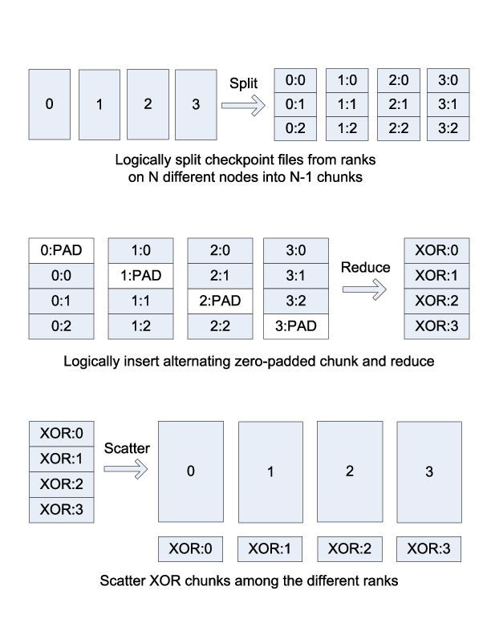
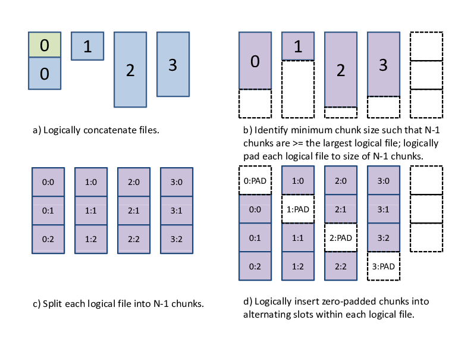
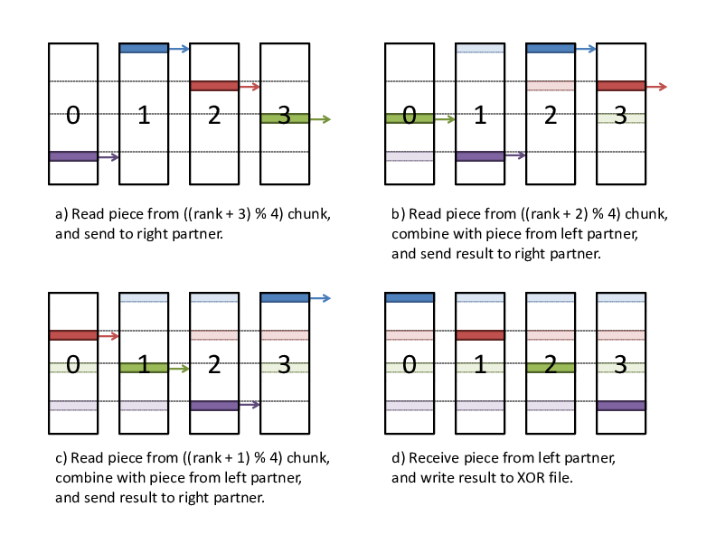
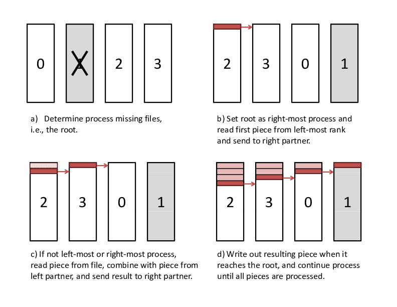

.. _xor:

XOR
---

The ``XOR`` redundancy scheme divides the set of processes in the run
into subsets, called *XOR sets*. For each dataset, each process in a set
computes and stores redundancy data in an *XOR file*. This file is
stored in the dataset subdirectory within the cache directory along side
any files that the application process writes.

The ``XOR`` redundancy scheme is designed such that the dataset files
for any single member of a set can be reconstructed using the dataset
files and ``XOR`` files from all remaining members. Thus, all dataset
files can be recovered, even if the files for one process from each set
are lost. On the other hand, if any set loses files for two or more
processes, the ``XOR`` redundancy scheme cannot recover all files.

The processes within each set are ordered, and each process has a *rank*
in the set, counting up from 0. The process whose rank in the set is one
less than the rank of the current process is called the *left neighbor*,
and the process whose rank is one more is the *right neighbor*. The last
rank wraps back to the first to form a ring. At run time, the library
caches the ``XOR`` set in the MPI communicator associated with a
redundancy descriptor. Each process also caches information abouts its
left and right neighbor processes in the redundancy descriptor.

SCR ensures that it does not select two processes from the same failure
group to be in the same ``XOR`` set. The ``SCR_SET_SIZE`` parameter
determines the minimum number of processes to include in a set. The
selection algorithm is implemented in ``scr_reddesc_create()`` and
``scr_reddesc_create_xor()`` in ``scr_reddesc.c``, as well as
``scr_set_partners()`` in ``scr_util_mpi.c``.

.. _raid:

XOR algorithm
~~~~~~~~~~~~~

The ``XOR`` redundancy scheme applies the algorithm described
in [Ross]_ (which is based on [RAID5]_). Assuming that each process
writes one file and that the files on all processes are the same size,
this algorithm is illustrated in Figure :ref:`1 <xor_fig>`. Given
:math:`N` processes in the set, each file is logically partitioned into
:math:`N-1` chunks, and an empty, zero-padded chunk is logically
inserted into the file at alternating positions depending on the rank of
the process. Then a reduce-scatter is computed across the set of logical
files. The resulting chunk from this reduce-scatter is the data that the
process stores in its ``XOR`` file.

.. _xor_fig:

   XOR reduce-scatter

In general, different processes may write different numbers of files,
and file sizes may be arbitrary. In
Figure :ref:`xor_general`, we illustrate how to
extend the algorithm for the general case. First, we logically
concatenate all of the files a process writes into a single file. We
then compute the minimum chunk size such that :math:`N-1` chunks are
equal to or larger than the largest logical file. Finally, we pad the
end of each logical file with zeros, such that each logical file extends
to the number of bytes contained in :math:`N-1` chunks. This extension
is efficient when all processes write about the same amount of data.

.. _xor_general:

   Extension to multiple files

In practice, to read from this logical file, we first open each physical
file, and then we call ``scr_read_pad_n()``. As input, this function
takes an array of file names, an array of file sizes, and an array of
opened file descriptors, along with an integer defining how many
elements are in each array, as well as, an offset and the number of
bytes to read. It returns data as if the set of files were concatenated
as a single file in the order specified by the arrays. This read also
pads the end of the concatenated file with zeros if the read extends
past the amount of real data. There is a corresponding
``scr_write_pad_n()`` function to issue writes to this logical file.
These functions are implemented in ``scr_io.c``.

This way, we can operate as though each process has exactly one file,
where each file has the same length and is evenly divisible by
:math:`N-1`. For an efficient reduce-scatter implementation, we use an
algorithm that achieves the following goals:

#. Evenly distributes the work among all processes in the set.

#. Structures communication so that a process always receives data from
   its left neighbor and sends data to its right neighbor. This is
   useful to eliminate network contention.

#. Only reads data from each checkpoint file once, and only writes data
   to the ``XOR`` file once. This minimizes file accesses, which may be
   slow.

#. Operates on the data in small pieces, so that the working set fits
   within the processor’s cache.

To accomplish this, we divide each chunk into a series of smaller
pieces, and we operate on each piece in phases. In the first phase, we
compute the reduce-scatter result for the first piece of all chunks.
Then, in the second phase, we compute the reduce-scatter result for the
second piece of all chunks, and so on. In each phase, the reduce-scatter
computation is pipelined among the processes. The first phase of this
reduce-scatter algorithm is illustrated in
Figure :ref:`reduce_scatter`. This algorithm
is implemented in ``scr_reddesc_apply_xor()`` in
``scr_reddesc_apply.c``.

.. _reduce_scatter:

   XOR reduce-scatter implementation

XOR file
~~~~~~~~

The ``XOR`` file contains a header, which is stored as a hash, followed
by the ``XOR`` chunk data, which is stored as binary data. The header
provides information on the process that wrote the file, meta data for
the process’s files, and the group of processes that belong to its
``XOR`` set. SCR also makes a copy of the meta data for a process’s
files in the header of the ``XOR`` file written by the process’s right
neighbor. This way, SCR can recover all meta data even if one ``XOR``
file is lost. An example header is shown below:

::

     DSET
       COMPLETE
         1
       SIZE
         2097182
       FILES
         4
       ID
         6
       NAME
         scr.dataset.6
       CREATED
         1312850690668536
       USER
         user1
       JOBNAME
         simulation123
       JOBID
         112573
       CKPT
         6
     RANKS
       4
     GROUP
       RANKS
         4
       RANK
         0
           0
         1
           1
         2
           2
         3
           3
     CHUNK
       174766
     CURRENT
       RANK
         3
       FILES
         1
       FILE
         0
           FILE
             rank_3.ckpt
           TYPE
             FULL
           RANKS
             4
           ORIG
             rank_3.ckpt
           PATH
             /p/lscratchb/user1/simulation123
           NAME
             rank_3.ckpt
           SIZE
             524297
           COMPLETE
             1
     PARTNER
       RANK
         2
       FILES
         1
       FILE
         0
           FILE
             rank_2.ckpt
           TYPE
             FULL
           RANKS
             4
           ORIG
             rank_2.ckpt
           PATH
             /p/lscratchb/user1/simulation123
           NAME
             rank_2.ckpt
           SIZE
             524296
           COMPLETE
             1

The topmost ``DSET`` field records the dataset descriptor the ``XOR``
file belongs to, and the topmost ``RANKS`` field records the number of
ranks in the run (i.e., the size of ``scr_comm_world``). The ``GROUP``
hash records the set of processes in the ``XOR`` set. The number of
processes in the set is listed under the ``RANKS`` field, and a mapping
of a process’s rank in the group to its rank in ``scr_comm_world`` is
stored under the ``RANK`` hash. The size of the ``XOR`` chunk in number
of bytes is specified in the ``CHUNK`` field.

Then, the meta data for the checkpoint files written by the process are
recorded under the ``CURRENT`` hash, and a copy of the meta data for the
checkpoint files written by the left neighbor are recorded under the
``PARTNER`` hash. Each hash records the rank of the process (in
``scr_comm_world``) under ``RANK``, the number of checkpoint files the
process wrote under ``FILES``, and a ordered list of meta data for each
file under the ``FILE`` hash. Each checkpoint file is assigned an
integer index, counting up from 0, which specifies the order in which
the files were logically concatenated to compute the ``XOR`` chunk. The
meta data for each file is then recorded under its index.

At times, ``XOR`` files from different processes reside in the same
directory, so SCR specifies a unique name for the ``XOR`` file on each
process. Furthermore, SCR encodes certain information in the file name
to simplify the task of grouping files belonging to the same set. SCR
assigns a unique integer id to each ``XOR`` set. To select this id, SCR
computes the minimum rank in ``scr_comm_world`` of all processes in the
set and uses that rank as the set id. SCR then incorporates a process’s
rank within its set, the size of its set, and its set id into its file
name, such that the ``XOR`` file name is of the form:
``<grouprank+1>_of_<groupsize>_in_<groupid>.xor``.

XOR rebuild
~~~~~~~~~~~

SCR provides two different methods to rebuild files using the ``XOR``
scheme. If a run is restarted and a dataset is stored in cache, then SCR
rebuilds files during ``SCR_Init()``. On the other hand, at the end of
an allocation, SCR can rebuild files after scavenging a dataset from
cache. This section discusses the method used in ``SCR_Init()``. For
discussion on rebuilding during a scavenge, see
Sections :ref:`Scavenge <drain>` and :ref:`Program Flow>Scavenge <flow_drain>`.

During ``SCR_Init()`` in a restarted run, SCR uses MPI to rebuild files
in parallel. The processes in each set check whether they need to and
whether they can rebuild any missing files. If so, the processes
identify which rank in the set needs its files rebuilt. This rank is
then set as the root of a reduction over the data in the remaining
application files and ``XOR`` files to reconstruct the missing data. SCR
implements a reduction algorithm that achieves the same goals as the
reduce-scatter described in Section :ref:`0.1.1 <raid>`. Namely, the
implementation attempts to distribute work evenly among all processes,
minimize network contention, and minimize file accesses. This algorithm
is implemented in ``scr_reddesc_recover_xor()`` in
``scr_reddesc_recover.c``. An example is illustrated in
Figure :ref:`xor_reduce`.

.. _xor_reduce:

   Pipelined XOR reduction to root

.. [Ross] W. Gropp, R. Ross, and N. Miller, “Providing Efficient I/O Redundancy in MPI Environments,” in Lecture Notes in Computer Science, 3241:7786, September 2004. 11th European PVM/MPI Users Group Meeting, 2004.

.. [RAID5] D. Patterson, G. Gibson, and R. Katz, “A Case for Redundant Arrays of Inexpensive Disks (RAID),” in Proc. of 1988 ACM SIGMOD Conf. on Management of Data, 1988.
