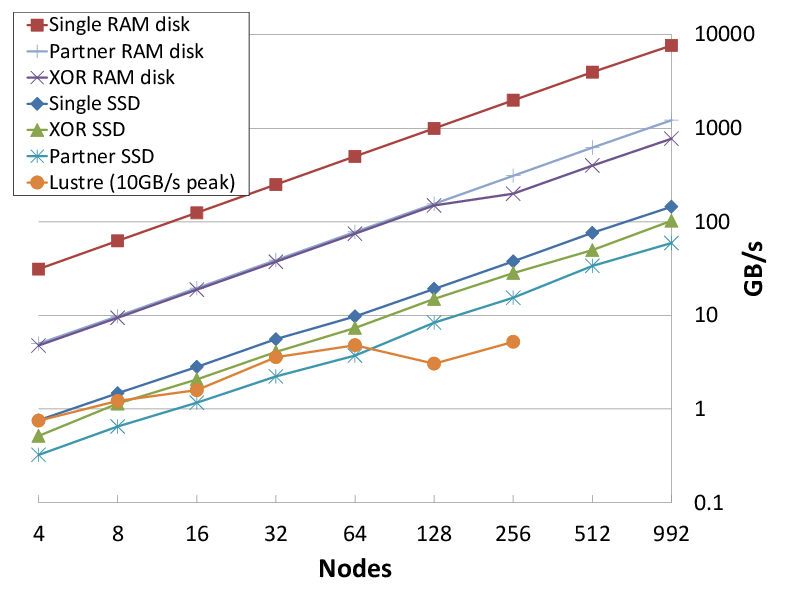

.. SCR documentation master file, created by
   sphinx-quickstart on Wed Dec 20 14:01:51 2017.
   You can adapt this file completely to your liking, but it should at least
   contain the root `toctree` directive.

Scalable Checkpoint / Restart (SCR) Developer Guide
===================================================

Welcome to the Developers Guide for the Scalable Checkpoint / Restart (SCR)
library. This guide contains three main sections to help developers get up to
speed with SCR:

Concepts
    This section defines essential concepts and to provide high-level
    explanation so that one may better understand the source code.
Files
    This section covers the contents of many of the files used in SCR. In order
    to not clutter the user's directory structure on the parallel file system,
    SCR writes its internal files to hidden "``.scr``" subdirectories.  See
    Section \ :ref:`directories_example` for an example of where these
    files are written.
Program Flow
    This section describes high-level program flow of various library routines
    and commands.
Testing
    This section describes testing practices related to SCR.

-----

The SCR library enables MPI applications to utilize distributed storage on
Linux clusters to attain high file I/O bandwidth for checkpointing, restarting,
and writing large datasets.
With SCR, jobs run more efficiently, recompute less work upon a failure,
and reduce load on shared resources like the parallel file system.
It provides the most benefit to large-scale jobs that write large datasets.
SCR utilizes tiered storage in a cluster to provide applications
with the following capabilities:

* guidance for the optimal checkpoint frequency,
* scalable checkpoint bandwidth,
* scalable restart bandwidth,
* scalable output bandwidth,
* asynchronous data transfers to the parallel file system.

SCR originated as a production-level implementation of a multi-level checkpoint system
of the type analyzed by [Vaidya]_
SCR caches checkpoints in scalable storage,
which is faster but less reliable than the parallel file system.
It applies a redundancy scheme to the cache such that checkpoints can be recovered after common system failures.
It also copies a subset of checkpoints to the parallel file system to recover from less common but more severe failures.
In many failure cases, a job can be restarted from a checkpoint in cache,
and writing and reading datasets in cache can be orders of magnitude faster than the parallel file system.

.. _fig-aggr_bw:

   Aggregate write bandwidth on Coastal

When writing a cached dataset to the parallel file system, SCR can transfer data asynchronously.
The application may continue once the data has been written to the cache
while SCR copies the data to the parallel file system in the background.
SCR supports general output datasets in addition to checkpoint datasets.

SCR consists of two components: a library and a set of commands.
The application registers its dataset files with the SCR API,
and the library maintains the dataset cache.
The SCR commands are typically invoked from the job batch script.
They are used to prepare the cache before a job starts,
automate the process of restarting a job,
and copy datasets from cache to the parallel file system upon a failure.

.. [Vaidya] "A Case for Two-Level Recovery Schemes", Nitin H. Vaidya, IEEE Transactions on Computers, 1998, http://doi.ieeecomputersociety.org/10.1109/12.689645.

.. _sec-contact:

Support
=======

The main repository for SCR is located at:

https://github.com/LLNL/scr.

From this site, you can download the source code and manuals for
the current release of SCR.

For information about the project including active research efforts, please visit:

https://computation.llnl.gov/project/scr

To contact the developers of SCR for help with using or porting SCR,
please visit:

https://computation.llnl.gov/project/scr/contact.php

There you will find links to join our discussion mailing list for help
topics, and our announcement list for getting notifications of new
SCR releases.

Contents
========

.. toctree::
   :maxdepth: 2
   :caption: Concepts

   developers/overview.rst
   developers/path.rst
   developers/hash.rst
   developers/filemap.rst
   developers/dataset.rst
   developers/meta.rst
   developers/group_descriptors.rst
   developers/store_descriptors.rst
   developers/redundancy_descriptors.rst
   developers/schemes.rst
   developers/scheme_xor.rst
   developers/containers.rst
   developers/drain.rst
   developers/logging.rst

.. toctree::
   :maxdepth: 2
   :caption: Files

   developers/file_index.rst
   developers/file_summary.rst
   developers/file_rank2file.rst
   developers/file_filemap.rst
   developers/file_flush.rst
   developers/file_halt.rst
   developers/file_nodes.rst
   developers/file_transfer.rst

.. toctree::
   :maxdepth: 2
   :caption: Program Flow

   developers/flow_util.rst
   developers/flow_launch.rst
   developers/flow_api.rst
   developers/flow_flush.rst
   developers/flow_drain.rst

.. toctree::
   :maxdepth: 2
   :caption: Testing

   developers/testing_new_systems.rst
   developers/testing_bamboo.rst
   developers/testing_gitlab.rst
