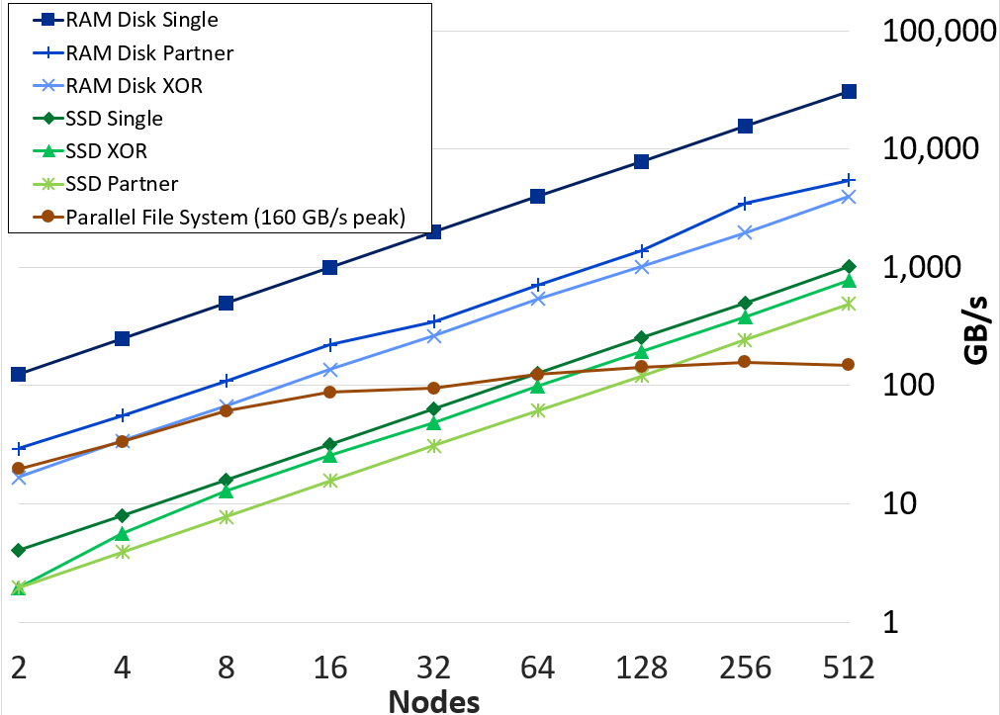

.. SCR documentation master file, created by
   sphinx-quickstart on Wed Dec 20 14:01:51 2017.
   You can adapt this file completely to your liking, but it should at least
   contain the root `toctree` directive.

Scalable Checkpoint / Restart (SCR) User Guide
==============================================

The Scalable Checkpoint / Restart (SCR) library enables MPI applications
to utilize distributed storage on Linux clusters to attain high file I/O bandwidth
for checkpointing, restarting, and writing large datasets.
With SCR, jobs run more efficiently, recompute less work upon a failure,
and reduce load on shared resources like the parallel file system.
It provides the most benefit to large-scale jobs that write large datasets.
Check out our video_ on how SCR works for more information.

.. _video: https://youtu.be/_r6svl_eAns

SCR provides the following capabilities:

* scalable checkpoint, restart, and output bandwidth,
* asynchronous data transfers to the parallel file system,
* guidance for the optimal checkpoint frequency,
* automated tracking and restart from the most recent checkpoint,
* automated job relaunch within an allocation after hangs or failures.

SCR provides API bindings for C/C++, Fortran, and Python applications.

SCR originated as a production-level implementation of a multi-level checkpoint system
of the type analyzed by [Vaidya]_
SCR caches checkpoints in scalable storage,
which is faster but less reliable than the parallel file system.
It applies a redundancy scheme to the cache such that checkpoints can be recovered after common system failures.
It copies a subset of checkpoints to the parallel file system to recover from less common but more severe failures.
In many failure cases, a job can be restarted from a cached checkpoint.
Reading and writing datasets to cache can be orders of magnitude faster than the parallel file system
as shown in the figure below.

.. _fig-aggr_bw:

   Aggregate write bandwidth with SCR on the Lassen system at LLNL.
   Each test runs with 40 processes per node,
   where each process writes a 1GB file and calls fsync.
   The RAM and SSD plots show the effective bandwidth achieved when
   writing to node-local storage and applying a given SCR redundancy scheme.

When writing a cached dataset to the parallel file system, SCR can transfer data asynchronously.
The application may continue once the data has been written to the cache
while SCR copies the data to the parallel file system in the background.
SCR supports general output datasets in addition to checkpoint datasets.

SCR consists of two components: a library and a set of commands.
The application registers its dataset files with the SCR API,
and the library maintains the dataset cache.
The SCR commands are typically invoked from the job batch script.
They are used to prepare the cache before a job starts,
automate the process of restarting a job,
and copy datasets from cache to the parallel file system upon a failure.
Though one gains the most benefit when using both,
one may use the SCR library without the SCR commands.

.. [Vaidya] "A Case for Two-Level Recovery Schemes", Nitin H. Vaidya, IEEE Transactions on Computers, 1998, http://doi.ieeecomputersociety.org/10.1109/12.689645.

.. _sec-contact:

Support and Additional Information
==================================

The main repository for SCR is located at:

https://github.com/LLNL/scr.

From this site, you can download the source code and manuals for
the current release of SCR.

For more information about the project including active research efforts, please visit:

* https://computing.llnl.gov/projects/scalable-checkpoint-restart-for-mpi
* https://insidehpc.com/2019/12/podcast-scr-scalable-checkpoint-restart-paves-the-way-for-exascale/
* https://www.youtube.com/watch?v=qt2VgIZaoNA
* https://youtu.be/_r6svl_eAns

To contact the developers of SCR for help with using or porting SCR,
please visit:

https://computing.llnl.gov/projects/scalable-checkpoint-restart-for-mpi/contact

There you will find links to join our discussion mailing list for help
topics, and our announcement list for getting notifications of new
SCR releases.

Contents
========

.. toctree::
   :maxdepth: 2

   users/quick.rst
   users/assumptions.rst
   users/overview.rst
   users/build.rst
   users/api.rst
   users/python_api.rst
   users/integration.rst
   users/config.rst
   users/run.rst
   users/halt.rst
   users/manage.rst

.. toctree::
   :hidden:

   users/directories_example.rst
