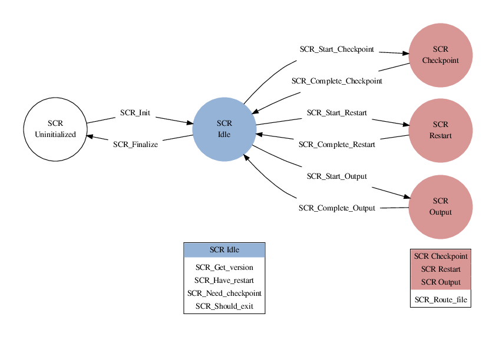

.. highlight:: c

.. _sec-lib-api:

SCR API
=======

SCR is designed to support MPI applications that write
application-level checkpoint and output datasets.
All processes must access data in a globally-coordinated fashion,
and in fact, many SCR calls are implicit collectives over all processes in :code:`MPI_COMM_WORLD`.
In a given dataset, each process may write zero or more files,
but the current implementation is most efficient when all processes write the same amount of data.
Multiple processes can access a given file, though significant performance is gained
by applications that use file-per-process access patterns,
where each file is only accessed by a single "owner" process.

Parallel file systems allow any process in an MPI job to
read/write any byte of a file at any time.
However, most applications do not require this full generality.
SCR supplies API calls that enable the application to specify
limits on its data access in both time and space.
Start and complete calls indicate when an application needs to write or read its data.
Files in the dataset cannot be accessed outside of these markers.
Additionally, for best performance, each MPI process may only access files written
by itself or another process having the same MPI rank in a previous run.
In this mode, an MPI process cannot access files written by a process having a different MPI rank.
SCR can provide substantial improvements in I/O performance by
enabling an application to specify its limits on when and where it needs to access its data.

The API is designed to be simple, scalable, and portable.
It consists of a small number of function calls to wrap existing application I/O logic.
Unless otherwise stated, SCR functions are collective,
meaning all processes in :code:`MPI_COMM_WORLD` must call the function synchronously.
The underlying implementation may or may not be synchronous,
but to be portable, an application must treat a collective call as though it is synchronous.
This constraint enables the SCR implementation to utilize the full resources of the job
in a collective manner to optimize performance at critical points
such as computing redundancy data.

In the sections below, we show the function prototypes for C and Fortran.
Applications written in C should include :code:`scr.h`,
and Fortran applications should include :code:`scrf.h`.
Unless otherwise noted, all functions return :code:`SCR_SUCCESS` if successful.

For Python applications, an :code:`scr.py` Python module wraps the functions of the C interface.
This module is located in the :code:`share/scr/python` directory of an SCR installation.
A :code:`README.md` file and an :code:`scr_example.py` program in the same directory
illustrate how one uses the :code:`scr.py` module. 
Python users should also be familiar with the API documentation in this section. 
For more details on Python APIs see :doc:`python_api`. 

Startup and Shutdown API
------------------------

SCR_Init
^^^^^^^^

::

  int SCR_Init(void);

.. code-block:: fortran
  
  SCR_INIT(IERROR)
    INTEGER IERROR

Initialize the SCR library.
This function must be called after :code:`MPI_Init`.
A process should only call :code:`SCR_Init` once during its execution.
It is not valid to call any SCR function before calling :code:`SCR_Init`, except for :code:`SCR_Config`.

The SCR library applies its configuration settings during :code:`SCR_Init`,
so any SCR parameters must be specified before calling :code:`SCR_Init`.
On runs restarted within an allocation, :code:`SCR_Init` rebuilds any cached datasets.

SCR_Finalize
^^^^^^^^^^^^

::

  int SCR_Finalize(void);
  
.. code-block:: fortran
  
  SCR_FINALIZE(IERROR)
    INTEGER IERROR

Shut down the SCR library.
This function must be called before :code:`MPI_Finalize`.
A process should only call :code:`SCR_Finalize` once during its execution.

If :code:`SCR_FLUSH` is enabled,
:code:`SCR_Finalize` flushes any datasets to the prefix directory if necessary.
It updates the halt file to indicate that :code:`SCR_Finalize` has been called.
This halt condition prevents the job from restarting (see :ref:`sec-halt`).

SCR_Config
^^^^^^^^^^

::

  const char* SCR_Config(const char* config);
  const char* SCR_Configf(const char* format, ...);

.. code-block:: fortran
  
  SCR_CONFIG(CONFIG, VAL, IERROR)
    CHARACTER*(*) CONFIG , VAL
    INTEGER IERROR

Configure the SCR library.
Most of the SCR configuration parameters listed in :ref:`sec-config` can be set, queried,
and unset at run time using :code:`SCR_Config`.
The application can make multiple calls to :code:`SCR_Config`, including for the same SCR configuration parameter.
All calls to :code:`SCR_Config` to set or unset parameter values must occur before the application calls :code:`SCR_Init`.
One may call :code:`SCR_Config` to query parameter values before and after :code:`SCR_Init` has been called.
This function is collective, and all processes must provide identical values for :code:`config`.

There are two forms of SCR configuration parameters:
a simple form that consists of a single key/value pair
and a multi-item form that consists of a parent key/value pair and set of child key/value pairs.

To set a simple parameter,
one specifies a parameter name and its value in the form of a :code:`key=value` string as the :code:`config` argument.
For example, passing the string :code:`SCR_FLUSH=10` sets :code:`SCR_FLUSH` to the value of 10. The `=` character
is allowed as part of the value if the value is a string.  For example, passing the string
:code:`SCR_PREFIX="/my/dir/with/=/sign"` sets :code:`SCR_PREFIX` to the value of "/my/dir/with/=/sign".

If one sets the same parameter with multiple calls to :code:`SCR_Config`,
SCR applies the most recent value.
When setting a parameter, for C applications, :code:`SCR_Config` always returns :code:`NULL`.
For Fortran applications, :code:`IERROR` is always set to :code:`SCR_SUCCESS`.

To query the value of a simple parameter, one specifies just the parameter name as the string in :code:`config`.
For example, one can specify the string :code:`SCR_FLUSH` to query its current value.
When querying a value, for C applications,
the call allocates and returns a pointer to a string holding the value of the parameter.
The caller is responsible for calling :code:`free` to release the returned string.
If the parameter has not been set, :code:`NULL` is returned.
For Fortran applications, the value is returned as a string in the :code:`VAL` argument.

To unset the value of a simple parameter, one specifies the parameter name with an empty value
in the form of a :code:`key=` string as the :code:`config` argument.
For example, to unset the value assigned to :code:`SCR_FLUSH`, specify the string :code:`SCR_FLUSH=`.
Unsetting a parameter removes any value that was assigned by a prior call to :code:`SCR_Config`,
but it does not unset the parameter value that has been set through other means,
like an environment variable or in a configuration file (see :ref:`sec-config`).
When unsetting a value, for C applications, :code:`SCR_Config` always returns :code:`NULL`.
For Fortran applications, :code:`IERROR` is always set to :code:`SCR_SUCCESS`.

Multi-item parameters like :code:`CKPT` can be set using a
sequence of :code:`key=value` pairs that are separated by spaces.
For example, to define a :code:`CKPT` redundancy descriptor,
one can pass a string such as :code:`CKPT=0 TYPE=XOR SET_SIZE=16`.

To query a subvalue of a multi-item parameter, one must specify the parent level :code:`key=value` pair followed
by the name of the child key being queried.
For instance, to get the type of the redundancy scheme of redundancy descriptor :code:`0`,
one can specify the string :code:`CKPT=0 TYPE`.

For C applications, :code:`SCR_Configf` provides a formatted string variant of :code:`SCR_Config`.
The caller can use printf-style formatting patterns to define the string, as in :code:`SCR_Configf("SCR_FLUSH=%d", 10)`.
This call otherwise behaves the same as :code:`SCR_Config`.

File Routing API
----------------

When files are under control of SCR,
they may be written to or exist on different levels of the storage hierarchy 
at different points in time.
For example, a checkpoint might be written first to the RAM disk of 
a compute node and then later transferred to the parallel file system by SCR.
In order for an application to discover where
a file should be written to or read from,
one calls the :code:`SCR_Route_file` routine.

The precise behavior of :code:`SCR_Route_file` varies depending on the current state of SCR.
Depending on the calling context, sections below extend the definition as described in this section.
This section describes general information about :code:`SCR_Route_file` that applies in all contexts.

SCR_Route_file
^^^^^^^^^^^^^^

::

  int SCR_Route_file(const char* name, char* file);
  
.. code-block:: fortran
  
  SCR_ROUTE_FILE(NAME, FILE, IERROR)
    CHARACTER*(*) NAME, FILE
    INTEGER IERROR

A process calls :code:`SCR_Route_file` to obtain the
full path and file name it must use to access a file.
A call to :code:`SCR_Route_file` is local to the calling process;
it is not a collective call.

The name of the file that the process intends to access must be passed in the :code:`name` argument.
This must be a relative or absolute path that specifies the location of the file on the parallel file system.
If given a relative path, SCR prepends the current working directory at the time :code:`SCR_Route_file` is called.
This path must resolve to a location under the prefix directory.

A pointer to a character buffer of at least :code:`SCR_MAX_FILENAME` bytes must be passed in :code:`file`.
When a call to :code:`SCR_Route_file` returns,
the full path and file name to access the file named in :code:`name` is written
to the buffer pointed to by :code:`file`.
The process must use the character string returned in :code:`file` to access the file.

If :code:`SCR_Route_file` is called outside of output and restart phases, i.e., outside of a Start/Complete pair,
the string in :code:`name` is copied verbatim into the output buffer :code:`file`.

The application does not need to create any directories in the path returned in :code:`file`.
The SCR library creates any needed directories before returning from :code:`SCR_Route_file`.

In the current implementation,
SCR only changes the directory portion of :code:`name` when storing files in cache.
It extracts the base name of the file by removing any directory components in :code:`name`.
Then it prepends a cache directory to the base file name
and returns the full path and file name in :code:`file`.

Checkpoint/Output API
---------------------

Here we describe the SCR API functions that are used for writing 
checkpoint and output datasets.
In addition to checkpoints, it may be useful for an application to write its output datasets
through SCR to utilize asynchronous transfers to the parallel file system.
This lets the application return to computation while the SCR library migrates
the dataset to the parallel file system in the background.

Using a combination of bit flags, a dataset can be designated as a checkpoint, output, or both.
The checkpoint property means that the dataset can be used to restart the application.
The output property means that the dataset must be written to the prefix directory.

If a user specifies that a dataset is a checkpoint only,
then SCR may delete an older checkpoint to store a more recent checkpoint
without having first copied the older checkpoint to the prefix directory.
SCR may thus discard some checkpoints from cache without persisting them to the parallel file system.
In cases where one can write checkpoints to cache much faster than one can write checkpoints to the parallel file system,
discarding defensive checkpoints in this way allows the application to checkpoint more frequently,
which can significantly improve run time efficiency.

If a user specifies that a dataset is for output only,
the dataset will first be cached and protected with its corresponding redundancy scheme.
Then the dataset will be copied to the prefix directory.
When the transfer to the prefix directory is complete,
the cached copy of the output dataset can be deleted.

If the user specifies that the dataset is both a checkpoint and output,
then SCR uses a hybrid approach.  
The dataset is copied to the prefix directory as output,
but it is also kept in cache according to the 
policy set in the configuration for checkpoints.
For example, if the user configures SCR to keep three checkpoints in cache,
then the dataset will be preserved in cache until it is replaced 
by a newer checkpoint after three more checkpoint phases.

SCR_Need_checkpoint
^^^^^^^^^^^^^^^^^^^

::

  int SCR_Need_checkpoint(int* flag);
  
.. code-block:: fortran
  
  SCR_NEED_CHECKPOINT(FLAG, IERROR)
    INTEGER FLAG, IERROR

Since the failure frequency and the cost of checkpointing vary across platforms,
:code:`SCR_Need_checkpoint` provides a portable way for an application
to determine whether a checkpoint should be taken.
This function is passed a pointer to an integer in :code:`flag`.
Upon returning from :code:`SCR_Need_checkpoint`,
:code:`flag` is set to the value :code:`1` if a checkpoint should be taken,
and it is set to :code:`0` otherwise.
The call returns the same value in :code:`flag` on all processes.

Various configuration settings determine the conditions
in which :code:`SCR_Need_checkpoint` sets :code:`flag` to 1.
See :code:`SCR_CHECKPOINT_INTERVAL`, :code:`SCR_CHECKPOINT_SECONDS`,
and :code:`SCR_CHECKPOINT_OVERHEAD` in :ref:`sec-config`.

SCR_Start_output
^^^^^^^^^^^^^^^^

::

  int SCR_Start_output(char* name, int flags);
  
.. code-block:: fortran
  
  SCR_START_OUTPUT(NAME, FLAGS, IERROR)
    CHARACTER*(*) NAME
    INTEGER FLAGS, IERROR

Inform SCR that a new output phase is about to start.
A process must call this function before it creates any files belonging to the dataset.
:code:`SCR_Start_output` must be called by all processes,
including processes that do not write files as part of the dataset.

The caller can provide a name for the dataset in :code:`name`.
It is recommended to define names that are user-friendly,
since an end user may need to read and type these names at times.
The name value must be less than :code:`SCR_MAX_FILENAME` characters.
All processes must provide identical values in :code:`name`.
In C, the application may pass :code:`NULL` for name
in which case SCR generates a default name for the dataset based on its internal dataset id.

The dataset can be output, a checkpoint, or both.
The caller specifies these properties using
:code:`SCR_FLAG_OUTPUT` and :code:`SCR_FLAG_CHECKPOINT` bit flags.
Additionally, a :code:`SCR_FLAG_NONE` flag is defined for initializing variables.
In C, these values can be combined with the :code:`|` bitwise OR operator.
In Fortran, these values can be added together using the :code:`+` sum operator.
Note that with Fortran, the values should be used at most once in the addition.
All processes must provide identical values in :code:`flags`.

This function should be called as soon as possible when initiating a new output dataset.
The SCR implementation uses this call as the starting point to time the cost of the
checkpoint in order to optimize the checkpoint frequency via :code:`SCR_Need_checkpoint`.

Each call to :code:`SCR_Start_output` must be followed by a corresponding call
to :code:`SCR_Complete_output`.

In the current implementation, :code:`SCR_Start_output` holds all processes
at an :code:`MPI_Barrier` to ensure that all processes are ready to start the
output before it deletes cached files from a previous checkpoint.

SCR_Route_file
^^^^^^^^^^^^^^

::

  int SCR_Route_file(const char* name, char* file);
  
.. code-block:: fortran
  
  SCR_ROUTE_FILE(NAME, FILE, IERROR)
    CHARACTER*(*) NAME, FILE
    INTEGER IERROR

A process must call :code:`SCR_Route_file` for each file it writes
as part of the output dataset.
It is valid for a process to call :code:`SCR_Route_file` multiple times for the same file.

When called within an output phase, between :code:`SCR_Start_output` and :code:`SCR_Complete_output`,
:code:`SCR_Route_file` registers the file as part of the output dataset.

A process does not need to create any directories listed in the string returned in :code:`file`.
The SCR implementation creates any necessary directories before it returns from :code:`SCR_Route_file`.
After returning from :code:`SCR_Route_file`, the process may create and open the target file for writing.

SCR_Complete_output
^^^^^^^^^^^^^^^^^^^

::

  int SCR_Complete_output(int valid);
  
.. code-block:: fortran
  
  SCR_COMPLETE_OUTPUT(VALID, IERROR)
    INTEGER VALID, IERROR

Inform SCR that all files for the current dataset output are complete (i.e., done writing and closed)
and whether they are valid (i.e., written without error).
A process must close all files in the dataset before calling :code:`SCR_Complete_output`,
and it may no longer access its dataset files upon calling :code:`SCR_Complete_output`.
:code:`SCR_Complete_output` must be called by all processes,
including processes that did not write any files as part of the output.

The parameter :code:`valid` should be set to :code:`1` either if the calling process wrote
all of its files successfully or if it wrote no files during the output phase.
Otherwise, the process should call :code:`SCR_Complete_output` with :code:`valid` set to :code:`0`.
SCR determines whether all processes wrote their output files successfully.
:code:`SCR_Complete_output` only returns :code:`SCR_SUCCESS` if all processes called with :code:`valid` set to :code:`1`,
meaning that all processes succeeded in their output.
The call returns the same value on all processes.

Each call to :code:`SCR_Complete_output` must be preceded by a corresponding call
to :code:`SCR_Start_output`.
The SCR implementation uses this call as the stopping point to time the cost of the checkpoint
that started with the preceding call to :code:`SCR_Start_output`.

In the current implementation,
SCR applies the redundancy scheme during :code:`SCR_Complete_output`.
The dataset is then flushed to the prefix directory if needed.

Restart API
-----------

Here we describe the SCR API functions used for restarting applications.

SCR_Have_restart
^^^^^^^^^^^^^^^^

::

  int SCR_Have_restart(int* flag, char* name);
  
.. code-block:: fortran
  
  SCR_HAVE_RESTART(FLAG, NAME, IERROR)
    INTEGER FLAG 
    CHARACTER*(*) NAME
    INTEGER IERROR

This function indicates whether SCR has a checkpoint available for the application to read.
This function is passed a pointer to an integer in :code:`flag`.
Upon returning from :code:`SCR_Have_restart`,
:code:`flag` is set to the value :code:`1` if a checkpoint is available,
and it is set to :code:`0` otherwise.
The call returns the same value in :code:`flag` on all processes.

A pointer to a character buffer of at least :code:`SCR_MAX_FILENAME` bytes can be passed in :code:`name`.
If there is a checkpoint, and if that checkpoint was assigned a name when it was created,
:code:`SCR_Have_restart` returns the name of that checkpoint in :code:`name`.
The value returned in :code:`name` is the same string that was passed to :code:`SCR_Start_output`
when the checkpoint was created.
The same value is returned in :code:`name` on all processes.
In C, one may optionally pass :code:`NULL` to this function to avoid returning the name.

SCR_Start_restart
^^^^^^^^^^^^^^^^^

::

  int SCR_Start_restart(char* name);
  
.. code-block:: fortran
  
  SCR_START_RESTART(NAME, IERROR)
    CHARACTER*(*) NAME
    INTEGER IERROR

This function informs SCR that a restart operation is about to start.
A process must call this function before it opens any files belonging to the restart.
:code:`SCR_Start_restart` must be called by all processes,
including processes that do not read files as part of the restart.

SCR returns the name of the loaded checkpoint in :code:`name`.
A pointer to a character buffer of at least :code:`SCR_MAX_FILENAME` bytes can be passed in :code:`name`.
The value returned in :code:`name` is the same string that was passed to :code:`SCR_Start_output`
when the checkpoint was created.
The same value is returned in :code:`name` on all processes.
In C, one may optionally pass :code:`NULL` to this function to avoid returning the name.

One may only call :code:`SCR_Start_restart`
when :code:`SCR_Have_restart` indicates that there is a checkpoint to read.
:code:`SCR_Start_restart` returns the same value in name as the preceding call to :code:`SCR_Have_restart`.

Each call to :code:`SCR_Start_restart` must be followed by a corresponding call
to :code:`SCR_Complete_restart`.

SCR_Route_file
^^^^^^^^^^^^^^

::

  int SCR_Route_file(const char* name, char* file);
  
.. code-block:: fortran
  
  SCR_ROUTE_FILE(NAME, FILE, IERROR)
    CHARACTER*(*) NAME, FILE
    INTEGER IERROR

A process must call :code:`SCR_Route_file` for each file it reads during restart.
It is valid for a process to call :code:`SCR_Route_file` multiple times for the same file.

When called within a restart phase, between :code:`SCR_Start_restart` and :code:`SCR_Complete_restart`,
SCR checks whether the file exists and is readable.
In this mode, :code:`SCR_Route_file` returns an error code if the file does not exist or is not readable.

It is recommended to provide the relative or absolute path to the file
under the prefix directory in :code:`name`.
However, for backwards compatibility,
the caller may provide only a file name in :code:`name`,
even if prepending the current working directory to the file name
does not resolve to the correct path to the file on the parallel file system.
Using just the file name, SCR internally looks up the full path to the file
using SCR metadata for the currently loaded checkpoint.
This usage is deprecated, and it may be not be supported in future releases.

SCR_Complete_restart
^^^^^^^^^^^^^^^^^^^^

::

  int SCR_Complete_restart(int valid);
  
.. code-block:: fortran
  
  SCR_COMPLETE_RESTART(VALID, IERROR)
    INTEGER VALID, IERROR

This call informs SCR that the process has finished reading its checkpoint files.
A process must close all restart files before calling :code:`SCR_Complete_restart`,
and it may no longer access its restart files upon calling :code:`SCR_Complete_restart`.
:code:`SCR_Complete_restart` must be called by all processes,
including processes that did not read any files as part of the restart.

The parameter :code:`valid` should be set to :code:`1` if either the calling process read  
all of its files successfully or it read no files as part of the restart.
Otherwise, the process should call :code:`SCR_Complete_restart` with :code:`valid` set to :code:`0`.
SCR determines whether all processes read their checkpoint files 
successfully based on the values supplied in the :code:`valid` parameter.
:code:`SCR_Complete_restart` only returns :code:`SCR_SUCCESS` if
all processes called with :code:`valid` set to :code:`1`,
meaning that all processes succeeded in their restart.
The call returns the same value on all processes.

If the restart failed on any process, SCR loads the next most recent checkpoint,
and the application can call :code:`SCR_Have_restart` to determine whether a new checkpoint is available.
An application can loop until it either successfully restarts from a checkpoint
or it exhausts all known checkpoints.

Each call to :code:`SCR_Complete_restart` must be preceded by a corresponding call
to :code:`SCR_Start_restart`.

General API
-----------

SCR_Get_version
^^^^^^^^^^^^^^^

::

  char* SCR_Get_version(void);
  
.. code-block:: fortran
  
  SCR_GET_VERSION(VERSION, IERROR)
    CHARACTER*(*) VERSION 
    INTEGER IERROR

This function returns a string that indicates the version number
of SCR that is currently in use.
The caller must not free the returned version string.

SCR_Should_exit
^^^^^^^^^^^^^^^

::

  int SCR_Should_exit(int* flag);
  
.. code-block:: fortran
  
  SCR_SHOULD_EXIT(FLAG, IERROR)
    INTEGER FLAG, IERROR

:code:`SCR_Should_exit` provides a portable way for an application
to determine whether it should halt its execution.
This function is passed a pointer to an integer in :code:`flag`.
Upon returning from :code:`SCR_Should_exit`,
:code:`flag` is set to the value :code:`1` if the application should stop,
and it is set to :code:`0` otherwise.
The call returns the same value in :code:`flag` on all processes.
It is recommended to call this function after each checkpoint.

It is critical for a job to stop early enough to leave time to copy datasets
from cache to the prefix directory before the allocation expires.
One can configure how early the job should exit within its allocation
by setting the :code:`SCR_HALT_SECONDS` parameter.

This call also enables a running application to react to external commands.
For instance, if the application has been instructed to halt using the :code:`scr_halt` command,
then :code:`SCR_Should_exit` relays that information.

Dataset Management API
----------------------

SCR provides functions to manage existing datasets.
These functions take a name argument,
which corresponds to the same name the application assigned to the dataset
when it called :code:`SCR_Start_output`.

SCR_Current
^^^^^^^^^^^

::

  int SCR_Current(const char* name);
  
.. code-block:: fortran
  
  SCR_CURRENT(NAME, IERROR)
    CHARACTER*(*) NAME
    INTEGER VALID, IERROR

There are two reasons an application might call :code:`SCR_Current`:
to request a particular checkpoint before calling the Restart API,
and to inform SCR about which checkpoint the application loaded if it does not call the Restart API.

An application can call :code:`SCR_Current` to set the current
marker within the SCR index file before it calls :code:`SCR_Have_restart`.
Any cached datasets that were created after the named checkpoint are deleted from cache.
SCR will then load the specified checkpoint to restart the application.

For applications that opt to not call the SCR Restart API,
it is recommended to call :code:`SCR_Current` to notify SCR about which checkpoint it loaded.
The application should pass the name of the checkpoint it restarted from in the :code:`name` argument.
This enables SCR to initialize its internal state to properly order
any new datasets that the application creates after it restarts.

SCR_Delete
^^^^^^^^^^

::

  int SCR_Delete(const char* name);
  
.. code-block:: fortran
  
  SCR_DELETE(NAME, IERROR)
    CHARACTER*(*) NAME
    INTEGER VALID, IERROR

Instruct SCR to delete a dataset.
The application provides the name of the dataset to be deleted in the :code:`name` argument.
SCR deletes all application files and its own internal metadata associated
with that dataset from both the prefix directory and cache.
SCR also deletes any directories that become empty as a result of deleting the
dataset files up to the SCR prefix directory.

SCR_Drop
^^^^^^^^

::

  int SCR_Drop(const char* name);
  
.. code-block:: fortran
  
  SCR_DROP(NAME, IERROR)
    CHARACTER*(*) NAME
    INTEGER VALID, IERROR

Instruct SCR to drop an entry for a dataset from the SCR index file.
SCR removes the entry for that dataset, but it does not delete any data files.
A common use for this function is to remove entries for datasets
that an application or user has deleted outside of SCR.
For instance, if an application deletes a dataset without calling :code:`SCR_Delete`,
it can call :code:`SCR_Drop` to maintain a consistent view of available datasets in the SCR index file.

Space/time semantics
--------------------

SCR imposes the following semantics which enable an application to limit where and when it accesses its data:

* For best performance,
  a process of a given MPI rank may only access files previously written by itself
  or by processes having the same MPI rank in prior runs.
  We say that a rank "owns" the files it writes.
  Shared access to files is permitted, though that may reduce performance.
* During a checkpoint/output phase,
  a process may only access files of the dataset
  between calls to :code:`SCR_Start_output` and :code:`SCR_Complete_output`.
  Once a process calls :code:`SCR_Complete_output` it may no longer access
  any file it registered as part of that dataset through a call to :code:`SCR_Route_file`.
* During a restart,
  a process may only access files from the currently loaded checkpoint,
  and it must access those files between calls to :code:`SCR_Start_restart` and :code:`SCR_Complete_restart`.
  Once a process calls :code:`SCR_Complete_restart` it may no longer access its restart files.
  SCR selects which checkpoint is considered to be the "most recent".

These semantics enable SCR to cache files on devices that are not globally visible to all processes,
such as node-local storage.
Further, these semantics enable SCR to move, reformat, or delete files as needed,
such that it can manage this cache.

SCR API state transitions
-------------------------

.. _fig-scr-states3:

   SCR API State Transition Diagram

Figure :ref:`fig-scr-states3` illustrates the internal states in
SCR and which API calls can be used from within each state.
The application must call :code:`SCR_Init` before it may call any other SCR function, except for :code:`SCR_Config`,
and it may not call SCR functions after calling :code:`SCR_Finalize`.
Some calls transition SCR from one state to another as shown by the edges between states.
Other calls are only valid when in certain states as shown in the boxes.
For example, :code:`SCR_Have_restart` is only valid within the Idle state.
All SCR functions are implicitly collective across :code:`MPI_COMM_WORLD`,
except for :code:`SCR_Route_file` and :code:`SCR_Get_version`.
