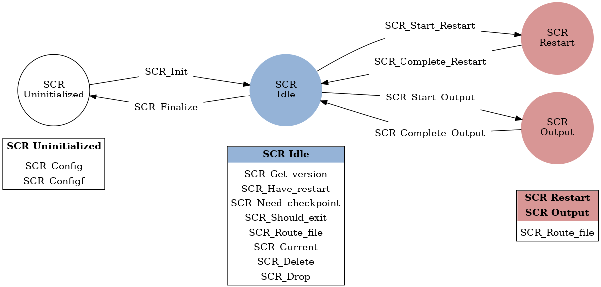

.. highlight:: c

.. _sec-lib-api:

SCR API
=======

SCR is designed to support MPI applications that write
application-level checkpoints and output datasets.
Both types of datasets (checkpoints and output) must be stored as a file-per-process,
and they must be accessed in a globally-coordinated fashion.
In a given dataset, each process may actually write zero or more files,
but the current implementation assumes that each process writes roughly the same amount of data.

Parallel file systems allow any process in an MPI job to
read/write any byte of a file at any time.
However, most applications do not require this full generality.
SCR supplies API calls that enable the application to specify
limits on its data access in both time and space.
Start and complete calls indicate when an application needs to write or read its data.
Data cannot be accessed outside of these markers.
Additionally, each MPI process may only read files written
by itself or another process having the same MPI rank in a previous run.
An MPI process cannot read files written by a process having a different MPI rank.

The API is designed to be simple, scalable, and portable.
It consists of a small number of function calls to wrap existing application I/O logic.
Unless otherwise stated, SCR functions are collective,
meaning all processes must call the function synchronously.
The underlying implementation may or may not be synchronous,
but to be portable, an application must treat a collective call as though it is synchronous.
This constraint enables the SCR implementation to utilize the full resources of the job
in a collective manner to optimize performance at critical points
such as computing redundancy data.

In the sections below, we show the function prototypes for C and Fortran, respectively.
Applications written in C should include ":code:`scr.h`",
and Fortran should include ":code:`scrf.h`".
All functions return :code:`SCR_SUCCESS` if successful.

General API
-----------

SCR_Init
^^^^^^^^

::

  int SCR_Init();

.. code-block:: fortran
  
  SCR_INIT(IERROR)
    INTEGER IERROR

Initialize the SCR library.
This function must be called after :code:`MPI_Init`, and
it is good practice to call this function immediately after :code:`MPI_Init`.
A process should only call :code:`SCR_Init` once during its execution.
No other SCR calls are valid until a process has returned from :code:`SCR_Init`.

SCR_Finalize
^^^^^^^^^^^^

::

  int SCR_Finalize();
  
.. code-block:: fortran
  
  SCR_FINALIZE(IERROR)
    INTEGER IERROR

Shut down the SCR library.
This function must be called before :code:`MPI_Finalize`, and
it is good practice to call this function just before :code:`MPI_Finalize`.
A process should only call :code:`SCR_Finalize` once during its execution.

If :code:`SCR_FLUSH` is enabled,
:code:`SCR_Finalize` flushes any datasets to the prefix directory if necessary.
It updates the halt file to indicate that :code:`SCR_Finalize` has been called.
This halt condition prevents the job from restarting (Section :ref:`sec-halt`).

SCR_Get_version
^^^^^^^^^^^^^^^

::

  char* SCR_Get_version(void);
  
.. code-block:: fortran
  
  SCR_GET_VERSION(VERSION, IERROR)
    CHARACTER*(*) VERSION 
    INTEGER IERROR

This function returns a string that indicates the version number
of SCR that is currently in use.

SCR_Should_exit
^^^^^^^^^^^^^^^

::

  int SCR_Should_exit(int* flag);
  
.. code-block:: fortran
  
  SCR_SHOULD_EXIT(FLAG, IERROR)
    INTEGER FLAG, IERROR

:code:`SCR_Should_exit` provides a portable way for an application
to determine whether it should halt its execution.
This function is passed a pointer to an integer in :code:`flag`.
Upon returning from :code:`SCR_Should_exit`,
:code:`flag` is set to the value :code:`1` if the application should stop,
and it is set to :code:`0` otherwise.
The call returns the same value in :code:`flag` on all processes.
It is recommended to call this function after each checkpoint.

Since datasets in cache may be deleted by the system at the end of an allocation,
it is critical for a job to stop early enough to leave time to copy datasets
from cache to the parallel file system before the allocation expires.
By default, the SCR library automatically calls :code:`exit` at certain points.
This works especially well in conjunction with the :code:`SCR_HALT_SECONDS` parameter.
However, this default behavior does not provide the application a chance to exit cleanly.
SCR can be configured to avoid an automatic exit using the :code:`SCR_HALT_ENABLED` parameter.

This call also enables a running application to react to external commands.
For instance, if the application has been instructed to halt using the :code:`scr_halt` command,
then :code:`SCR_Should_exit` relays that information.

SCR_Route_file
^^^^^^^^^^^^^^

::

  int SCR_Route_file(const char* name, char* file);
  
.. code-block:: fortran
  
  SCR_ROUTE_FILE(NAME, FILE, IERROR)
    CHARACTER*(*) NAME, FILE
    INTEGER IERROR

When files are under control of SCR, they may
be written to or exist on different levels of the storage hierarchy 
at different points in time.
For example, a checkpoint might be written first to the RAM disk of 
a compute node and then later transferred to a burst buffer or the 
parallel file system by SCR. In order for an application to discover where
a file should be written to or read from, we provide the 
:code:`SCR_Route_file` routine.

A process calls :code:`SCR_Route_file` to obtain the full path and file name
it must use to access a file under SCR control.
The name of the file that the process intends to access must be passed in the :code:`name` argument.
A pointer to a character buffer of at least :code:`SCR_MAX_FILENAME` bytes must be passed in :code:`file`.
When a call to :code:`SCR_Route_file` returns,
the full path and file name to access the file named in :code:`name` is written
to the buffer pointed to by :code:`file`.
The process must use the character string returned in :code:`file` to access the file.
A process does not need to create any directories listed in the string returned in :code:`file`.
The SCR implementation creates any necessary directories before returning from the call.
A call to :code:`SCR_Route_file` is local to the calling process; it is not a collective call.

As of version 1.2.2, :code:`SCR_Route_file` can be succesfully called at any point during application execution.
If it is called outside of a Start/Complete pair, the original file path is simply copied to the return string.

:code:`SCR_Route_file` has special behaviour when called within a Start/Complete pair
for restart, checkpoint, or output.
Within a restart operation, the input parameter :code:`name` only requires a file name.
No path component is needed.
SCR will return a full path to the file from the most recent checkpoint having the same name.
It will return an error if no file by that name exists.
Within checkpoint and output operations, the input parameter :code:`name` also specifies
the final path on the parallel file system.
The caller may provide either absolute or relative path components in :code:`name`.
If the path is relative, SCR prepends the current working directory to :code:`name`
at the time that :code:`SCR_Route_file` is called.
With either an absolute or relative path, all paths must resolve to a location
within the subtree rooted at the SCR prefix directory.

In the current implementation,
SCR only changes the directory portion of :code:`name`.
It extracts the base name of the file by removing any directory components in :code:`name`.
Then it prepends a directory to the base file name
and returns the full path and file name in :code:`file`.

Checkpoint API
--------------

Here we describe the SCR API functions that are used for writing 
checkpoints.

SCR_Need_checkpoint
^^^^^^^^^^^^^^^^^^^

::

  int SCR_Need_checkpoint(int* flag);
  
.. code-block:: fortran
  
  SCR_NEED_CHECKPOINT(FLAG, IERROR)
    INTEGER FLAG, IERROR

Since the failure frequency and the cost of checkpointing vary across platforms,
:code:`SCR_Need_checkpoint` provides a portable way for an application
to determine whether a checkpoint should be taken.
This function is passed a pointer to an integer in :code:`flag`.
Upon returning from :code:`SCR_Need_checkpoint`,
:code:`flag` is set to the value :code:`1` if a checkpoint should be taken,
and it is set to :code:`0` otherwise.
The call returns the same value in :code:`flag` on all processes.

SCR_Start_checkpoint
^^^^^^^^^^^^^^^^^^^^

::

  int SCR_Start_checkpoint();
  
.. code-block:: fortran
  
  SCR_START_CHECKPOINT(IERROR)
    INTEGER IERROR

Inform SCR that a new checkpoint is about to start.
A process must call this function before it opens any files belonging to the new checkpoint.
:code:`SCR_Start_checkpoint` must be called by all processes,
including processes that do not write files as part of the checkpoint.
This function should be called as soon as possible when initiating a checkpoint.
The SCR implementation uses this call as the starting point to time the cost of the
checkpoint in order to optimize the checkpoint frequency via :code:`SCR_Need_checkpoint`.
Each call to :code:`SCR_Start_checkpoint` must be followed by a corresponding call
to :code:`SCR_Complete_checkpoint`.

In the current implementation, :code:`SCR_Start_checkpoint` holds all processes
at an :code:`MPI_Barrier` to ensure that all processes are ready to start the
checkpoint before it deletes cached files from a previous checkpoint.

SCR_Complete_checkpoint
^^^^^^^^^^^^^^^^^^^^^^^

::

  int SCR_Complete_checkpoint(int valid);
  
.. code-block:: fortran
  
  SCR_COMPLETE_CHECKPOINT(VALID, IERROR)
    INTEGER VALID, IERROR

Inform SCR that all files for the current checkpoint are complete (i.e., done writing and closed)
and whether they are valid (i.e., written without error).
A process must close all checkpoint files before calling :code:`SCR_Complete_checkpoint`.
:code:`SCR_Complete_checkpoint` must be called by all processes,
including processes that did not write any files as part of the checkpoint.

The parameter :code:`valid` should be set to :code:`1` if either the calling process wrote
all of its files successfully or it wrote no files during the checkpoint.
Otherwise, the process should call :code:`SCR_Complete_checkpoint` with :code:`valid` set to :code:`0`.
SCR will determine whether all processes wrote their checkpoint files successfully.

The SCR implementation uses this call as the stopping point to time the cost of the checkpoint
that started with the preceding call to :code:`SCR_Start_checkpoint`.
Each call to :code:`SCR_Complete_checkpoint` must be preceded by a corresponding call
to :code:`SCR_Start_checkpoint`.

In the current implementation,
SCR applies the redundancy scheme during :code:`SCR_Complete_checkpoint`.
Before returning from the function,
MPI rank 0 determines whether the job should be halted
and signals this condition to all other ranks (Section :ref:`sec-halt`).
If the job should be halted, rank 0 records a reason in the halt file,
and then all tasks call :code:`exit`, unless the auto exit feature is disabled.

Restart API
-----------

Here we describe the SCR API functions used for restarting applications.

SCR_Have_restart
^^^^^^^^^^^^^^^^

::

  int SCR_Have_restart(int* flag, char* name);
  
.. code-block:: fortran
  
  SCR_HAVE_RESTART(FLAG, NAME, IERROR)
    INTEGER FLAG 
    CHARACTER*(*) NAME
    INTEGER IERROR

This function indicates whether SCR has a checkpoint available for the application to read.
This function is passed a pointer to an integer in :code:`flag`.
Upon returning from :code:`SCR_Have_restart`,
:code:`flag` is set to the value :code:`1` if a checkpoint is available,
and it is set to :code:`0` otherwise.
The call returns the same value in :code:`flag` on all processes.

A pointer to a character buffer of at least :code:`SCR_MAX_FILENAME` bytes can be passed in :code:`name`.
If there is a checkpoint, and if that checkpoint was assigned a name when it was created,
:code:`SCR_Have_restart` returns the name of that checkpoint in :code:`name`.
The value returned in :code:`name` is the same string that was passed to :code:`SCR_Start_output`
when the checkpoint was created.
In C, one may optionally pass :code:`NULL` to this function to avoid returning the name.
The same value is returned in :code:`name` on all processes.

SCR_Start_restart
^^^^^^^^^^^^^^^^^

::

  int SCR_Start_restart(char* name);
  
.. code-block:: fortran
  
  SCR_START_RESTART(NAME, IERROR)
    CHARACTER*(*) NAME
    INTEGER IERROR

This function informs SCR that a restart operation is about to start.
A process must call this function before it opens any files belonging to the restart.
:code:`SCR_Start_restart` must be called by all processes,
including processes that do not read files as part of the restart.

SCR returns the name of loaded checkpoint in :code:`name`.
A pointer to a character buffer of at least :code:`SCR_MAX_FILENAME` bytes can be passed in :code:`name`.
The value returned in :code:`name` is the same string that was passed to :code:`SCR_Start_output`
when the checkpoint was created.
In C, one may optionally pass :code:`NULL` to this function to avoid returning the name.
The same value is returned in :code:`name` on all processes.

One may only call :code:`SCR_Start_restart`
when :code:`SCR_Have_restart` indicates that there is a checkpoint to read.
:code:`SCR_Start_restart` returns the same value in name as the preceding call to :code:`SCR_Have_restart`.

Each call to :code:`SCR_Start_restart` must be followed by a corresponding call
to :code:`SCR_Complete_restart`.

SCR_Complete_restart
^^^^^^^^^^^^^^^^^^^^

::

  int SCR_Complete_restart(int valid);
  
.. code-block:: fortran
  
  SCR_COMPLETE_RESTART(VALID, IERROR)
    INTEGER VALID, IERROR

This call informs SCR that the process has finished reading its checkpoint files.
A process must close all restart files before calling :code:`SCR_Complete_restart`.
:code:`SCR_Complete_restart` must be called by all processes,
including processes that did not read any files as part of the restart.

The parameter :code:`valid` should be set to :code:`1` if either the calling process read  
all of its files successfully or it read no files during the checkpoint.
Otherwise, the process should call :code:`SCR_Complete_restart` with :code:`valid` set to :code:`0`.
SCR will determine whether all processes read their checkpoint files 
successfully based on the values supplied in the :code:`valid` parameter.
If any process failed to read its checkpoint files, then SCR will abort.

Each call to :code:`SCR_Complete_restart` must be preceded by a corresponding call
to :code:`SCR_Start_restart`.

Output API
----------

As of SCR version 1.2.0, SCR has the ability to manage application output datasets in 
addition to checkpoint datasets.
Using a combination of bit flags, a dataset can be designated as a checkpoint, output, or both.
The checkpoint property means that the dataset can be used to restart the application.
The output property means that the dataset must be written to the prefix directory.
This enables an application to utilize asynchronous transfers to the parallel file system
for both its checkpoints and large output sets,
so that it can return to computation while the dataset migrates to the parallel file system in the background.

If a user specifies that a dataset is a checkpoint only, then the 
dataset will be managed with the SCR Output API as it would be
if the SCR Checkpoint API were used.
In particular, SCR may delete the checkpoint
when a more recent checkpoint is established.

If a user specifies that a dataset is for output only,
the dataset will first be cached on a
tier of storage specified in the configuration file for the run
and protected with the corresponding redundancy scheme.
Then, the dataset will be moved to the prefix directory.
When the transfer to the prefix directory is complete,
the cached copy of the output dataset will be deleted.

If the user specifies that the dataset is both output and checkpoint,
then SCR will use a hybrid approach.  
Files in the dataset will be cached and redundancy
schemes will be used to protect the files. 
The dataset will be copied to the prefix directory,
but it will also be kept in cache according to the 
policy set in the configuration for checkpoints.
For example, 
if the user has set the configuration to keep three checkpoints
in cache, then the dataset will be preserved until it is replaced 
by a newer checkpoint after three more checkpoint phases.

SCR_Start_output
^^^^^^^^^^^^^^^^

::

  int SCR_Start_output(char* name, int flags);
  
.. code-block:: fortran
  
  SCR_START_OUTPUT(NAME, FLAGS, IERROR)
    CHARACTER*(*) NAME
    INTEGER FLAGS, IERROR

Inform SCR that a new output phase is about to start.
A process must call this function before it opens any files belonging to the dataset.
:code:`SCR_Start_output` must be called by all processes,
including processes that do not write files as part of the dataset.

The caller can provide a name for the dataset in :code:`name`.
This name is used in two places.
First, for checkpoints, it is returned as the name value in the SCR Restart API.
Second, it is exposed to the user when listing datasets using the :code:`scr_index` command,
and the user may specify the name as a command line argument at times.
For this reason, it is recommended to use short but meaningful names that are easy to type.
The name value must be less than :code:`SCR_MAX_FILENAME` characters.
All processes should provide identical values in :code:`name`.
In C, the application may pass :code:`NULL` for name
in which case SCR generates a default name for the dataset based on its internal dataset id.

The dataset can be output, a checkpoint, or both.
The caller specifies these properties using
:code:`SCR_FLAG_OUTPUT` and :code:`SCR_FLAG_CHECKPOINT` bit flags.
Additionally, a :code:`SCR_FLAG_NONE` flag is defined for initializing variables.
In C, these values can be combined with the :code:`|` bitwise OR operator.
In Fortran, these values can be added together using the :code:`+` sum operator.
Note that with Fortran, the values should be used at most once in the addition.
All processes should provide identical values in :code:`flags`.

This function should be called as soon as possible when initiating a dataset output.
It is used internally within SCR for timing the cost of output operations.
Each call to :code:`SCR_Start_output` must be followed by a corresponding call
to :code:`SCR_Complete_output`.

In the current implementation, :code:`SCR_Start_output` holds all processes
at an :code:`MPI_Barrier` to ensure that all processes are ready to start the
output before it deletes cached files from a previous checkpoint.

SCR_Complete_output
^^^^^^^^^^^^^^^^^^^

::

  int SCR_Complete_output(int valid);
  
.. code-block:: fortran
  
  SCR_COMPLETE_OUTPUT(VALID, IERROR)
    INTEGER VALID, IERROR

Inform SCR that all files for the current dataset output are complete (i.e., done writing and closed)
and whether they are valid (i.e., written without error).
A process must close all files in the dataset before calling :code:`SCR_Complete_output`.
:code:`SCR_Complete_output` must be called by all processes,
including processes that did not write any files as part of the output.

The parameter :code:`valid` should be set to :code:`1` if either the calling process wrote
all of its files successfully or it wrote no files during the output phase.
Otherwise, the process should call :code:`SCR_Complete_output` with :code:`valid` set to :code:`0`.
SCR will determine whether all processes wrote their output files successfully.

Each call to :code:`SCR_Complete_output` must be preceded by a corresponding call
to :code:`SCR_Start_output`.

For the case of checkpoint datasets,
:code:`SCR_Complete_output` behaves similarly to :code:`SCR_Complete_checkpoint`.

Space/time semantics
--------------------

SCR imposes the following semantics:

* A process of a given MPI rank may only access files previously written by itself
  or by processes having the same MPI rank in prior runs.
  We say that a rank "owns" the files it writes.
  A process is never guaranteed access to files written by other MPI ranks.
* During a checkpoint,
  a process may only access files of the current checkpoint
  between calls to :code:`SCR_Start_checkpoint()` and :code:`SCR_Complete_checkpoint()`.
  Once a process calls :code:`SCR_Complete_checkpoint()` it is no longer guaranteed access to
  any file that it registered as part of that checkpoint via :code:`SCR_Route_file()`.
* During a restart,
  a process may only access files from its "most recent" checkpoint,
  and it must access those files between calls to :code:`SCR_Start_restart()` and :code:`SCR_Complete_restart()`.
  Once a process calls :code:`SCR_Complete_restart()` it is no longer guaranteed access to its restart files.
  SCR selects which checkpoint is considered to be the "most recent".

These semantics enable SCR to cache files on devices that are not globally visible to all processes,
such as node-local storage.
Further, these semantics enable SCR to move, reformat, or delete files as needed,
such that it can manage this cache.

SCR API state transitions
-------------------------

.. _fig-scr-states3:

   SCR API State Transition Diagram

Figure :ref:`fig-scr-states3` illustrates the internal states in
SCR and which API calls can be used from within each state.
The application must call :code:`SCR_Init` before it may call any other SCR function,
and it may not call SCR functions after calling :code:`SCR_Finalize`.
Some calls transition SCR from one state to another as shown by the edges between states.
Other calls are only valid when in certain states as shown in the boxes.
For example, :code:`SCR_Route_file` is only valid within the Checkpoint, Restart, or Output states.
All SCR functions are implicitly collective across :code:`MPI_COMM_WORLD`,
except for :code:`SCR_Route_file` and :code:`SCR_Get_version`.
