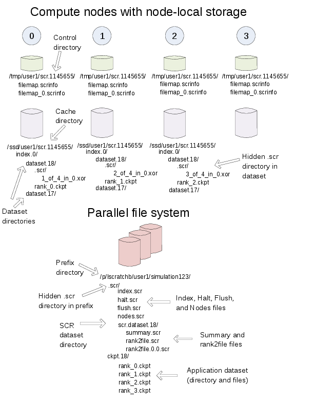

To illustrate how files and directories are arranged in SCR,
consider the example shown in Figure :ref:`fig-directories_wide`.
In this example, a user named ":code:`user1`"
runs a 4-task MPI job with one task per compute node.
The base directory for the control directory is :code:`/tmp`,
the base directory for the cache directory is :code:`/ssd`,
and the prefix directory is :code:`/p/lscratchb/user1/simulation123`.
The control and cache directories are storage devices local to the compute node.

.. _fig-directories_wide:

   Example SCR directories

The full path of the control directory is :code:`/tmp/user1/scr.1145655`.
This is derived from the concatenation of the control base directory (:code:`/tmp`),
the user name (:code:`user1`), and the allocation id (:code:`1145655`).
SCR keeps files to persist its internal state in the control directory,
including filemap files as shown.

Similarly, the cache directory is :code:`/ssd/user1/scr.1145655`,
which is derived from the concatenation of the cache base directory (:code:`/ssd`),
the user name (:code:`user1`), and the allocation id (:code:`1145655`).
Within the cache directory, SCR creates a subdirectory for each dataset.
In this example, there are two datasets with ids 17 and 18.
The application dataset files and SCR redundancy files
are stored within their corresponding dataset directory.
On the node running MPI rank 0,
there is one application dataset file (:code:`rank_0.ckpt`)
and one XOR redundancy data file (:code:`1_of_4_in_0.xor`).

Finally, the full path of the prefix directory is :code:`/p/lscratchb/user1/simulation123`.
This is a path on the parallel file system that is specified by the user.
It is unique to the particular simulation the user is running (:code:`simulation123`).
The prefix directory contains dataset directories.
It also contains a hidden :code:`.scr` directory where SCR writes
the index file to record info for each of the datasets (Section :ref:`sec-scr_index`).
The SCR library writes other files to this hidden directory,
including the "halt" file (Section :ref:`sec-halt`).

While the user provides the prefix directory,
SCR defines the name of each dataset directory to be ":code:`scr.dataset.<id>`"
where :code:`<id>` is the dataset id.
In this example, there are multiple datasets stored on the parallel file system
corresponding to dataset ids 10, 12, and 18.
Within each dataset directory, SCR stores the files written by the application.
SCR also creates a hidden :code:`.scr` subdirectory,
and this hidden directory contains redundancy files and other SCR files
that are specific to the dataset.
