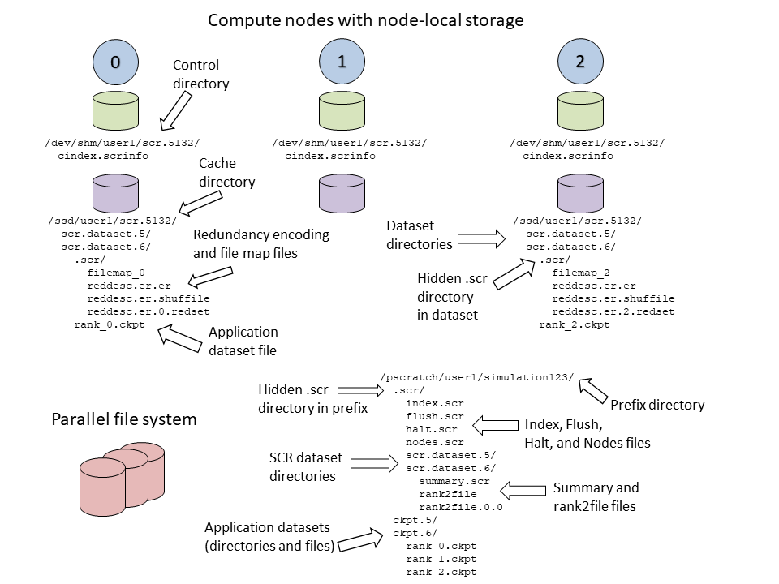

To illustrate how files and directories are arranged in SCR,
consider the example shown in Figure :ref:`fig-directories_wide`.
In this example, a user named :code:`user1`
runs a 3-task MPI job with one task per compute node.
The base directory for the control directory is :code:`/dev/shm`,
the base directory for the cache directory is :code:`/ssd`,
and the prefix directory is :code:`/pscratch/user1/simulation123`.
The control and cache directories are storage devices local to the compute node.

.. _fig-directories_wide:

   Example SCR directories

The full path of the control directory is :code:`/dev/shm/user1/scr.5132`.
This is derived from the concatenation of the control base directory :code:`/dev/shm`,
the user name :code:`user1`, and the allocation id :code:`5132`.
SCR keeps files to persist its internal state in the control directory,
including a :code:`cindex.scrinfo` file as shown.

Similarly, the cache directory is :code:`/ssd/user1/scr.5132`,
which is derived from the concatenation of the cache base directory :code:`/ssd`,
the user name :code:`user1`, and the allocation id :code:`5132`.
Within the cache directory, SCR creates a subdirectory for each dataset.
In this example, there are two datasets with ids :code:`5` and :code:`6`.
The application dataset files and SCR redundancy files
are stored within their corresponding dataset directory.
On the node running MPI rank 0,
there is one application dataset file :code:`rank_0.ckpt`,
and numerous SCR metadata files in a hidden :code:`.scr` subdirectory.

The full path of the prefix directory is :code:`/pscratch/user1/simulation123`.
This is a path on the parallel file system that is specified by the user.
It is unique to the particular simulation the user is running :code:`simulation123`.

The prefix directory contains a hidden :code:`.scr` directory where SCR writes
its :code:`index.scr` file to record info for each of the datasets (see :ref:`sec-scr_index`).
The SCR library writes other files to this hidden directory,
including the :code:`halt.scr` file (see :ref:`sec-halt`).
Within the :code:`.scr` directory, SCR also creates a directory
for each dataset named :code:`scr.dataset.<id>` where :code:`<id>` is the dataset id.
SCR stores metadata files that are specific to the dataset in these dataset directories
including :code:`summary.scr` and :code:`rank2file` files along with redundancy files.

Application files for each dataset are written to their original path within the prefix directory
as the application specified during its call to :code:`SCR_Route_file`.
In this example, the application stores all files for a particular dataset within its own subdirectory.
There are directories named :code:`ckpt.5` and :code:`ckpt.6` corresponding to two datasets.
The files from all processes for each dataset are contained within its respective :code:`ckpt` directory.
Application file names and directory paths can be arbitrary so long as all items are placed within
the prefix directory and item names in each dataset are distinct from names in other datasets.
