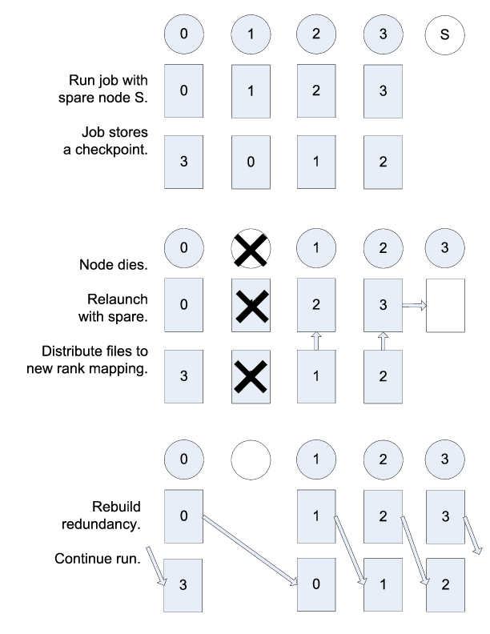

.. _sec-concepts:

Concepts
========

This section discusses concepts one should understand about the SCR library
implementation including how it interacts with file systems.

Jobs, allocations, and runs
---------------------------

A large-scale simulation often must be restarted multiple times in order to run to completion.
It may be interrupted due to a failure,
or it may be interrupted due to time limits imposed by the resource scheduler.
We use the term *allocation* to refer to an assigned set of compute resources
that are available to the user for a period of time.
A resource manager typically assigns an identifier to each resource allocation,
which we refer to as the *allocation id*.
SCR uses the allocation id in some directory and file names.
Within an allocation, a user may execute a simulation one or more times.
We call each execution a *run*.
For MPI applications, each run corresponds to a single invocation
of :code:`mpirun` or its equivalent.
Finally, multiple allocations may be required to complete a given simulation.
We refer to this series of one or more allocations as a *job*.
To summarize,
one or more runs occur within an allocation,
and one or more allocations occur within a job.

Group, store, and redundancy descriptors
----------------------------------------

The SCR library must group processes of the parallel job in various ways.
For example, if power supply failures are common,
it is necessary to identify the set of processes that share a power supply.
Similarly, it is necessary to identify all processes that can access a given
storage device, such as an SSD mounted on a compute node.
To represent these groups, the SCR library uses a *group descriptor*.
Details of group descriptors are given in Section :ref:`sec-descriptors`.

Each group is given a unique name. 
The library creates two groups by default: :code:`NODE` and :code:`WORLD`.
The :code:`NODE` group consists of all processes on the same compute node,
and :code:`WORLD` consists of all processes in the run.
The user or system administrator can create additional groups
via configuration files (Section :ref:`sec-config`).

The SCR library must also track details about each class of storage it can access.
For each available storage class, SCR needs to know the associated directory prefix,
the group of processes that share a device, the capacity of the device, and other
details like whether the associated file system can support directories.
SCR tracks this information in a *store descriptor*.
Each store descriptor refers to a group descriptor,
which specifies how processes are grouped with respect to that class of storage.
For a given storage class, it is assumed that all compute nodes refer
to the class using the same directory prefix.
Each store descriptor is referenced by its directory prefix.

The library creates one store descriptor by default: :code:`/tmp`.
The assumption is made that :code:`/tmp` is mounted as a local file system
on each compute node.
On Linux clusters, :code:`/tmp` is often RAM disk or a local hard drive.
Additional store descriptors can be defined by the user or
system administrator in configuration files (Section :ref:`sec-config`).

Finally, SCR defines *redundancy descriptors* to associate a redundancy scheme
with a class of storage devices and a group of processes that are likely to fail at the same time.
It also tracks details about the particular redundancy scheme used,
and the frequency with which it should be applied.
Redundancy descriptors reference both store and group descriptors.

The library creates a default redundancy descriptor.
It assumes that processes on the same node are likely to fail at the same time.
It also assumes that datasets can be cached in :code:`/tmp`,
which is assumed to be storage local to each compute node.
It applies an :code:`XOR` redundancy scheme using a group size of 8.
Additional redundancy descriptors may be defined by the user
or system administrator in configuration files (Section :ref:`sec-config`).

.. _sec-checkpoint_directories:

Control, cache, and prefix directories
--------------------------------------

SCR manages numerous files and directories to cache datasets and to record its internal state.
There are three fundamental types of directories: control, cache, and prefix directories.
For a detailed illustration of how these files and directories are arranged,
see the example presented in Section :ref:`sec-directories_example`.

The *control directory* is where SCR writes files to store internal state about the current run.
This directory is expected to be stored in node-local storage.
SCR writes multiple, small files in the control directory,
and it may access these files frequently.
It is best to configure this directory to be stored in a node-local RAM disk.

To construct the full path of the control directory,
SCR incorporates a control base directory name along with
the user name and allocation id associated with the resource allocation.
This enables multiple users, or multiple jobs by the same user,
to run at the same time without conflicting for the same control directory.
The control base directory is hard-coded into the SCR library at configure time,
but this value may be overridden via a system configuration file.
The user may not change the control base directory.

SCR directs the application to write dataset files to subdirectories
within a *cache directory*.
SCR also stores its redundancy data in these subdirectories.
The device serving the cache directory must be large enough to hold
the data for one or more datasets plus the associated redundancy data.
Multiple cache directories may be utilized in the same run,
which enables SCR to use more than one class of storage
within a run (e.g., RAM disk and SSD).
Cache directories should be located on scalable storage.

To construct the full path of a cache directory,
SCR incorporates a cache base directory name with
the user name and the allocation id associated with the resource allocation.
A set of valid cache base directories is hard-coded into the SCR library at configure time,
but this set can be overridden in a system configuration file.
Out of this set, the user may select a subset of cache base
directories to use during a run.
A cache directory may be the same as the control directory.

The user must configure the maximum number of datasets
that SCR should keep in each cache directory.
It is up to the user to ensure that the capacity of the device associated with
the cache directory is large enough to hold the specified number of datasets.

SCR refers to each application checkpoint or output set as a *dataset*.
SCR assigns a unique sequence number to each dataset called the *dataset id*.
It assigns dataset ids starting from 1 and counts up with each
successive dataset written by the application.
Within a cache directory,
a dataset is written to its own subdirectory called the *dataset directory*.

Finally, the *prefix directory* is a directory on the parallel
file system that the user specifies.
SCR copies datasets to the prefix directory
for permanent storage (Section :ref:`sec-fetch_flush_drain`).
The prefix directory should be accessible from all compute nodes,
and the user must ensure that the prefix directory is unique for each job.
For each dataset stored in the prefix directory,
SCR creates and manages a *dataset directory*.
The dataset directory holds all SCR redundancy files and meta data associated with a particular dataset.
SCR maintains an index file within the prefix directory,
which records information about each dataset stored there.

Note that the term "dataset directory" is overloaded.
In some cases, we use this term to refer to a directory in cache
and in other cases we use the term to refer to a directory within the prefix directory
on the parallel file system.
In any particular case, the meaning should be clear from the context.

.. _sec-directories_example:

Example of SCR files and directories
------------------------------------

.. include:: directories_example.rst

.. _sec-redundancy:

Scalable checkpoint
-------------------

In practice, it is common for multiple processes to fail at the same time,
but most often this happens because those processes depend on a single, failed component.
It is not common for multiple, independent components to fail simultaneously.
By expressing the groups of processes that are likely to fail at the same time,
the SCR library can apply redundancy schemes to withstand common, multi-process failures.
We refer to a set of processes likely to fail at the same time as a *failure group*.

SCR must also know which groups of processes share a given storage device.
This is useful so the group can coordinate its actions when accessing the device.
For instance, if a common directory must be created before each process writes a file,
a single process can create the directory and then notify the others.
We refer to a set of processes that share a storage device as a *storage group*.

Users and system administrators can pass information about failure and 
storage groups to SCR in descriptors defined in configuration files 
(See Section :ref:`sec-descriptors`).
Given this knowledge of failure and storage groups,
the SCR library implements three redundancy schemes
which trade off performance, storage space, and reliability:

* :code:`Single` - each checkpoint file is written to storage accessible to the local process
* :code:`Partner` - each checkpoint file is written to storage accessible to the local process,
  and a full copy of each file is written to storage accessible to a partner process from another failure group
* :code:`XOR` - each checkpoint file is written to storage accessible to the local process,
  XOR parity data are computed from checkpoints of a set of processes from different failure groups,
  and the parity data are stored among the set.

With :code:`Single`, SCR writes each checkpoint file in storage accessible to the local process.
It requires sufficient space to store the maximum checkpoint file size.
This scheme is fast, but it cannot withstand failures that disable the storage device.
For instance, when using node-local storage,
this scheme cannot withstand failures that disable the node,
such as when a node loses power or its network connection.
However, it can withstand failures that kill the application processes
but leave the node intact, such as application bugs and file I/O errors.

With :code:`Partner`, SCR writes checkpoint files to storage accessible to the local process,
and it also copies each checkpoint file to storage accessible to a partner process from another failure group.
This scheme is slower than :code:`Single`, and it requires twice the storage space.
However, it is capable of withstanding failures that disable a storage device.
In fact, it can withstand failures of multiple devices,
so long as a device and the device holding the copy do not fail simultaneously.

With :code:`XOR`, SCR defines sets of processes
where members within a set are selected from different failure groups.
The processes within a set collectively compute XOR parity data which is
stored in files along side the application checkpoint files.
This algorithm is based on the work found in [Gropp]_,
which in turn was inspired by RAID5 [Patterson]_.
This scheme can withstand multiple failures so long as two processes from the
same set do not fail simultaneously.

Computationally, :code:`XOR` is more expensive than :code:`Partner`,
but it requires less storage space.
Whereas :code:`Partner` must store two full checkpoint files,
:code:`XOR` stores one full checkpoint file plus one XOR parity segment,
where the segment size is roughly :math:`1/(N-1)` times the size of a checkpoint file for a set of size N.
Larger sets demand less storage,
but they also increase the probability that two processes in the same set will fail simultaneously.
Larger sets may also increase the cost of recovering files in the event of a failure.

.. [Patterson] "A Case for Redundant Arrays of Inexpensive Disks (RAID)", D. Patterson, G. Gibson, and R. Katz, Proc. of 1988 ACM SIGMOD Conf. on Management of Data, 1988, http://web.mit.edu/6.033/2015/wwwdocs/papers/Patterson88.pdf.

.. [Gropp] "Providing Efficient I/O Redundancy in MPI Environments", William Gropp, Robert Ross, and Neill Miller, Lecture Notes in Computer Science, 3241:7786, September 2004. 11th European PVM/MPI Users Group Meeting, 2004, http://www.mcs.anl.gov/papers/P1178.pdf.

.. _sec-restart:

Scalable restart
----------------

So long as a failure does not violate the redundancy scheme,
a job can restart within the same resource allocation using the cached checkpoint files.
This saves the cost of writing checkpoint files out to the parallel file
system only to read them back during the restart.
In addition, SCR provides support for the use of spare nodes.
A job can allocate more nodes than it needs
and use the extra nodes to fill in for any failed nodes during a restart.
SCR includes a set of scripts which encode much of the restart logic (Section :ref:`sec-scripts`).

Upon encountering a failure,
SCR relies on the MPI library, the resource manager, or some other external service
to kill the current run.
After the run is killed,
and if there are sufficient healthy nodes remaining,
the same job can be restarted within the same allocation.
In practice, such a restart typically amounts to issuing another
":code:`mpirun`" in the job batch script.

Of the set of nodes used by the previous run,
the restarted run should use as many of the same nodes as it can
to maximize the number of files available in cache.
A given MPI rank in the restarted run does not need to run
on the same node that it ran on in the previous run.
SCR distributes cached files among processes according to
the process mapping of the restarted run.

By default, SCR inspects the cache for existing checkpoints when a job starts.
It attempts to rebuild all datasets in cache,
and then it attempts to restart the job from the most recent checkpoint.
If a checkpoint fails to rebuild, SCR deletes it from cache.
To disable restarting from cache, set the :code:`SCR_DISTRIBUTE` parameter to 0.
When disabled, SCR deletes all files from cache and restarts from a checkpoint on the parallel file system.

An example restart scenario is illustrated in Figure :ref:`sec-restart`
in which a 4-node job using the :code:`Partner` scheme allocates 5 nodes
and successfully restarts within the allocation after a node fails.

.. _fig-restart:

   Example restart after a failed node with :code:`Partner`

.. _sec-vulnerabilities:

Catastrophic failures
---------------------

There are some failures from which the SCR library cannot recover.
In such cases, the application is forced to fall back to the
latest checkpoint successfully written to the parallel file system.
Such catastrophic failures include the following:

* **Multiple node failure which violates the redundancy scheme.**
  If multiple nodes fail in a pattern which violates the cache redundancy scheme,
  data are irretrievably lost.
* **Failure during a checkpoint.**
  Due to cache size limitations, some applications can only fit one
  checkpoint in cache at a time.
  For such cases, a failure may occur after the library has deleted the previous checkpoint
  but before the next checkpoint has completed.
  In this case, there is no valid checkpoint in cache to recover.
* **Failure of the node running the job batch script.**
  The logic at the end of the allocation to scavenge the latest checkpoint from
  cache to the parallel file system executes as part of the job batch script.
  If the node executing this script fails,
  the scavenge logic will not execute and the allocation will terminate without copying
  the latest checkpoint to the parallel file system.
* **Parallel file system outage.**
  If the application fails when writing output due to an outage of the parallel file system,
  the scavenge logic may also fail when it attempts to copy files to the parallel file system.

There are other catastrophic failure cases not listed here.
Checkpoints must be written to the parallel file system with some moderate
frequency so as not to lose too much work in the event of a catastrophic failure.
Section :ref:`sec-fetch_flush_drain` provides details on how to configure SCR to make occasional
writes to the parallel file system.

By default, the current implementation stores only the most recent checkpoint in cache.
One can change the number of checkpoints stored in cache by setting
the :code:`SCR_CACHE_SIZE` parameter.
If space is available, it is recommended to increase this value to at least 2.

.. _sec-fetch_flush_drain:

Fetch, flush, and scavenge
--------------------------

SCR manages the transfer of datasets between the prefix directory
on the parallel file system and the cache.
We use the term *fetch* to refer to the action of copying
a dataset from the parallel file system to cache.
When transferring data in the other direction,
there are two terms used: *flush* and *scavenge*.
Under normal circumstances, the library directly copies files
from cache to the parallel file system,
and this direct transfer is known as a flush.
However, sometimes a run is killed before the library can complete this transfer.
In these cases, a set of SCR commands is executed after the final run to ensure that the
latest checkpoint is copied to the parallel file system before the allocation expires.
We say that these scripts scavenge the latest checkpoint.

Each time an SCR job starts,
SCR first inspects the cache and attempts to distribute files for a scalable restart
as discussed in Section :ref:`sec-restart`.
If the cache is empty or the distribute operation fails or is disabled,
SCR attempts to fetch a checkpoint from the prefix directory to fill the cache.
SCR reads the index file and attempts to fetch the most recent checkpoint,
or otherwise the checkpoint that is marked as current within the index file.
For a given checkpoint, SCR records whether the fetch attempt succeeds or fails in the index file.
SCR does not attempt to fetch a checkpoint that is marked as being incomplete
nor does it attempt to fetch a checkpoint for which a previous fetch attempt has failed.
If SCR attempts but fails to fetch a checkpoint, it prints an error and continues the run.

To disable the fetch operation, set the :code:`SCR_FETCH` parameter to 0.
If an application disables the fetch feature,
the application is responsible for reading its checkpoint set directly from
the parallel file system upon a restart.

To withstand catastrophic failures,
it is necessary to write checkpoint sets out to the parallel file system with some moderate frequency.
In the current implementation,
the SCR library writes a checkpoint set out to the parallel file system after every 10 checkpoints.
This frequency can be configured by setting the :code:`SCR_FLUSH` parameter.
When this parameter is set, SCR decrements a counter with each successful checkpoint.
When the counter hits 0, SCR writes the current checkpoint set out to the file system and resets the counter
to the value specified in :code:`SCR_FLUSH`.
SCR preserves this counter between scalable restarts,
and when used in conjunction with :code:`SCR_FETCH`,
it also preserves this counter between fetch and flush operations
such that it is possible to maintain periodic checkpoint writes across runs.
Set :code:`SCR_FLUSH` to 0 to disable periodic writes in SCR.
If an application disables the periodic flush feature,
the application is responsible for writing occasional checkpoint sets to the parallel file system.

By default, SCR computes and stores a CRC32 checksum value for each checkpoint file during a flush.
It then uses the checksum to verify the integrity of each file as it is read back into cache during a fetch.
If data corruption is detected, SCR falls back to fetch an earlier checkpoint set.
To disable this checksum feature, set the :code:`SCR_CRC_ON_FLUSH` parameter to 0.
